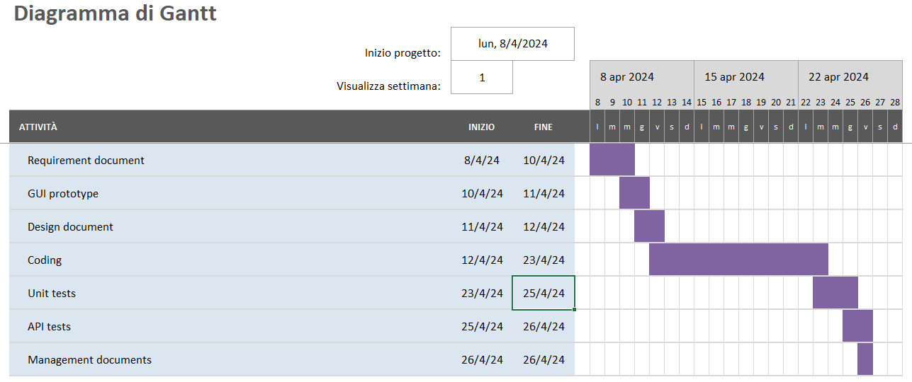

# Project Estimation - CURRENT
Date: 29/04/2024

Version:

# Estimation approach
Consider the EZElectronics  project in CURRENT version (as given by the teachers), assume that you are going to develop the project INDEPENDENT of the deadlines of the course, and from scratch
# Estimate by size
### 
|             | Estimate                        |             
| ----------- | ------------------------------- |  
| NC =  Estimated number of classes to be developed   |       28                      |             
|  A = Estimated average size per class, in LOC       |        60                   | 
| S = Estimated size of project, in LOC (= NC * A) | 1680 |
| E = Estimated effort, in person hours (here use productivity 10 LOC per person hour)  |     168    |   
| C = Estimated cost, in euro (here use 1 person hour cost = 30 euro) | 5040 | 
| Estimated calendar time, in calendar weeks (Assume team of 4 people, 8 hours per day, 5 days per week ) |   1    |               

# Estimate by product decomposition
### 
|         component name    | Estimated effort (person hours)   |             
| ----------- | ------------------------------- | 
|requirement document    |12 | 
| GUI prototype |6|
|design document |2|
|code |168|
| unit tests |10|
| api tests |10|
| management documents  |1|

# Estimate by activity decomposition
### 

# Summary

La differenza tra le diverse stime dipende dalle attività prese in considerazione nel calcolo delle person hours (nel primo calcolo è stato preso in considerazione solo il periodo di scrittura del codice). Inoltre dipende anche dalla suddivisione dei compiti nei giorni lavorativi, contando eventuali problematiche e imprevisti.

|             | Estimated effort                        |   Estimated duration  |          
| ----------- | ------------------------------- | ---------------|
| estimate by size |168 ph |1 week
| estimate by product decomposition |209 ph|1,5 weeks
| estimate by activity decomposition |480 ph|2 weeks

