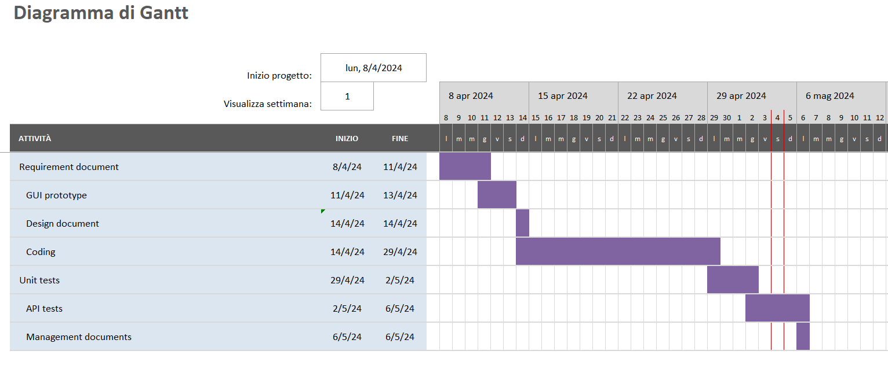

# Project Estimation - FUTURE
Date: 

Version: 2

# Estimation approach
Consider the EZElectronics  project in FUTURE version (as proposed by your team in requirements V2), assume that you are going to develop the project INDEPENDENT of the deadlines of the course, and from scratch (not from V1)
# Estimate by size
### 
|             | Estimate                        |             
| ----------- | ------------------------------- |  
| NC =  Estimated number of classes to be developed   |            5                 |             
|  A = Estimated average size per class, in LOC       |            450                | 
| S = Estimated size of project, in LOC (= NC * A) |2250 |
| E = Estimated effort, in person hours (here use productivity 10 LOC per person hour)  |            225                         |   
| C = Estimated cost, in euro (here use 1 person hour cost = 30 euro) |6750 | 
| Estimated calendar time, in calendar weeks (Assume team of 4 people, 8 hours per day, 5 days per week ) |       1,4 weeks (working days)            |               

# Estimate by product decomposition
### 
|         component name    | Estimated effort (person hours)   |             
| ----------- | ------------------------------- | 
|requirement document    | 20|
| GUI prototype |10|
|design document |2|
|code |120|
| unit tests |25|
| api tests |25|
| management documents  |2|

# Estimate by activity decomposition
### 

| Activity name        | Estimated effort (person hours) |
|----------------------------------------|----------------------------------|
|**requirement document**|**22**|
|ricerca dei requisiti|7|
|trascrizione dei requisiti|8|
|analisi dei requisiti|7|
|**GUI prototype**|**11**|
|progettazione delle interfacce|3|
|disegno delle interfacce|8|
|**design document**|**2**|
|**code**|**120**|
|scrittura del codice|80|
|revisione del codice|40|
|**unit tests**|**26**|
|applicazione dei test|5|
|analisi dei test|11|
|risoluzione dei problemi rilevati dai test|10|
|**api tests**|**25**|
|applicazione dei test|5|
|analisi dei test|10|
|risoluzione dei problemi rilevati dai test|10|
|**management documents**|**2**|

# Summary

I dati seguenti sono stati stimati prendendo in considerazione l'effort impiegato dal gruppo per il presente progetto, mettendolo in relazione con le ore di lavoro effettuate. La differenza tra le diverse stime dipende dalla suddivisione dei compiti nei giorni lavorativi, contando eventuali problematiche e imprevisti.

|             | Estimated effort                        |   Estimated duration |          
| ----------- | ------------------------------- | ---------------|
| estimate by size |225 ph| 1,4 weeks (working days)
| estimate by product decomposition |204 ph| 1,2 weeks (working days)
| estimate by activity decomposition |206 ph| 1,2 weeks (working days)

