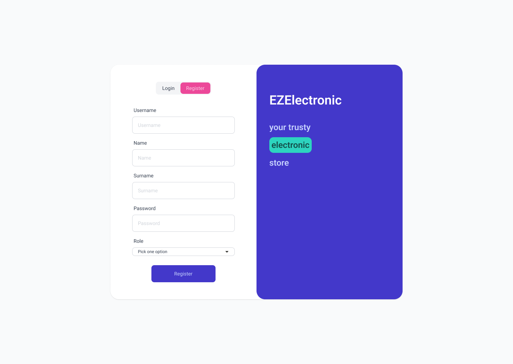
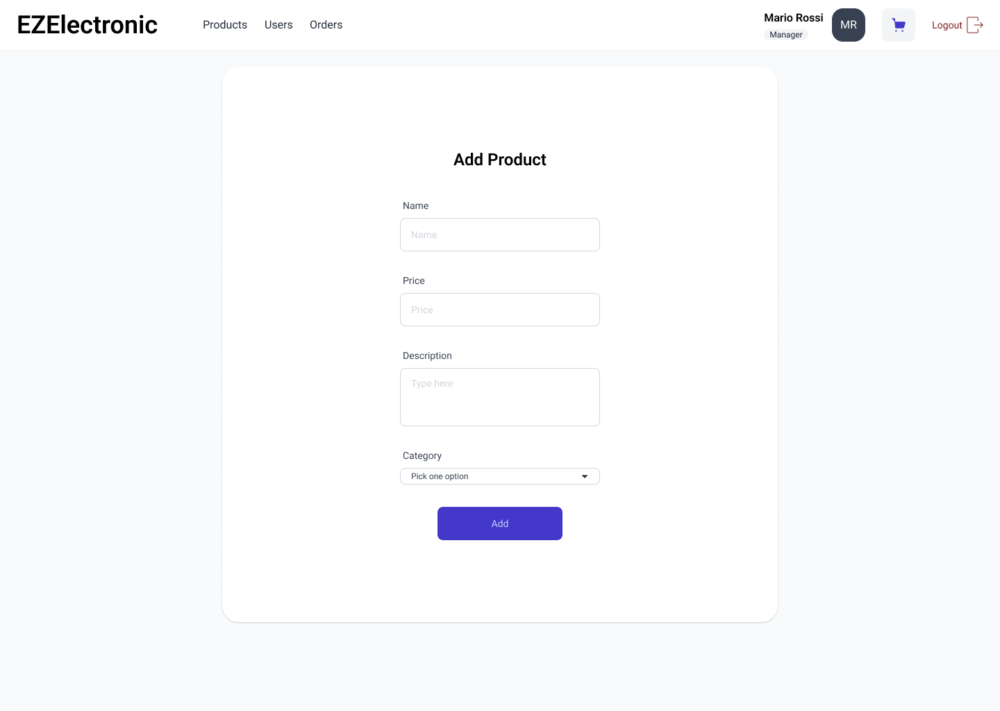
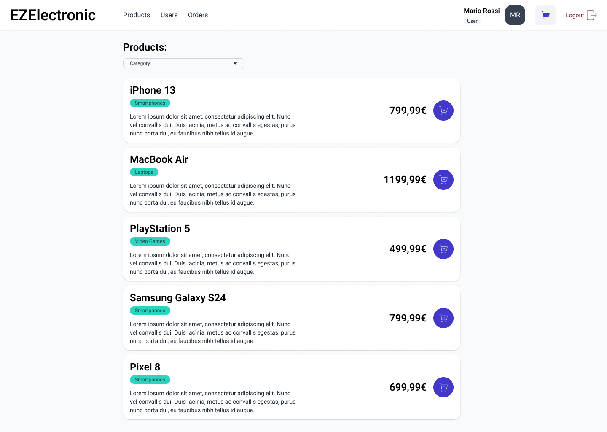
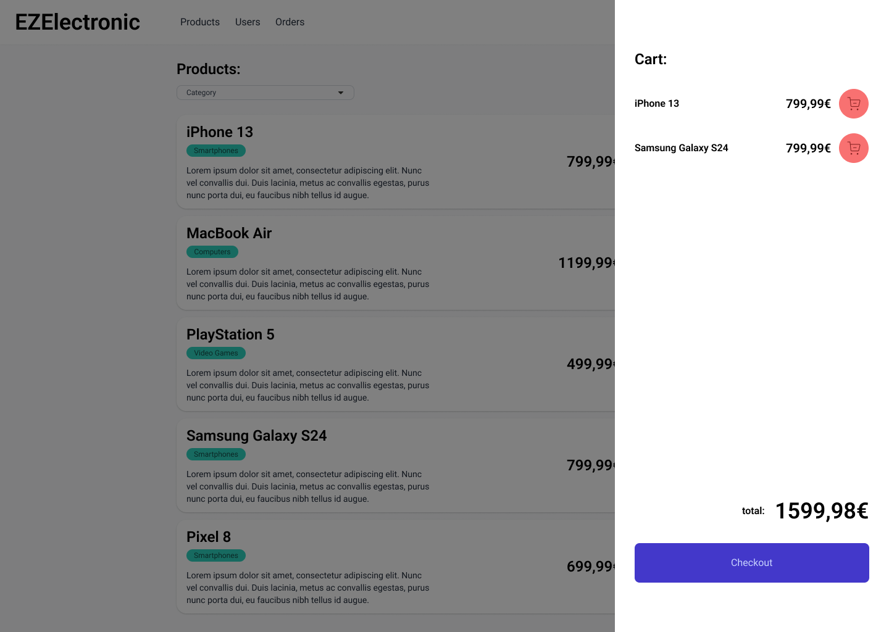
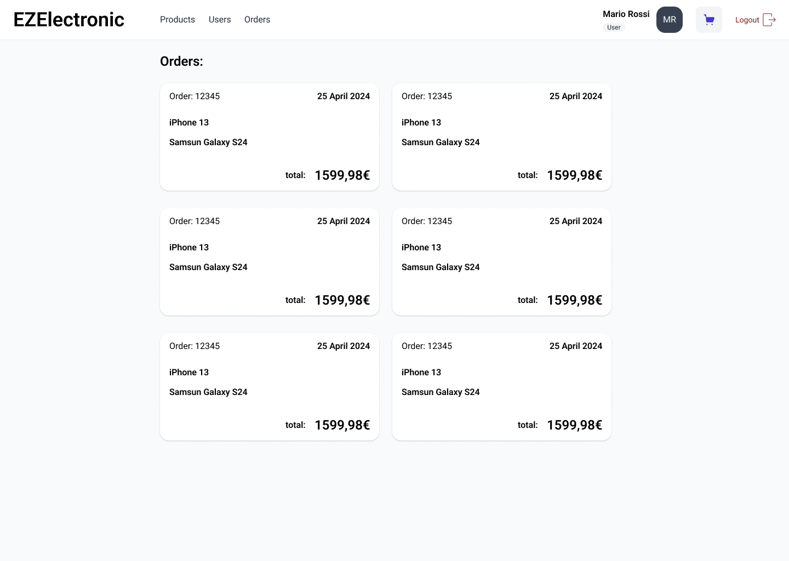

# Graphical User Interface Prototype - CURRENT

Authors:

Date:

Version:

## Regsitrazione

## Login

## Aggiungi Prodotto

In questa pagina un **Manager** può inserire un nuovo prodotto.

## Prodotti

Vi si accede dal link _Products_ della navbar. Nella pagina è mostrata una lista con le informazioni di base dei prodotti (node, descrizione, categoria, prezzo) ed un
bottone per aggiungere il prodotto selezionato al carrello. I prodotti possono essere filtrati per **Category**.

## Carrello

Vi si accede facendo un click sull'icona del carrello della navbar (in alto a destra). Vengono mostarti i prodotti che un utente ha messo nel carrello ed un bottone
per confermare l'ordine. Vi è anche un bottone per ciascun prodotto che permette di rimuover il suddetto dal carrello.

## Utenti

Vi si accede dal link _Users_ della navbar. Nella pagina è mostrata una lista di tutti gli utenti. Gli utenti possono essere filtrati per **Role** e **Username**.

## Ordini

Vi si accede dal link _Orders_ della navbar. Nella pagina viene mostrata una lista di tutti gli ordini effettuati da un utente.

