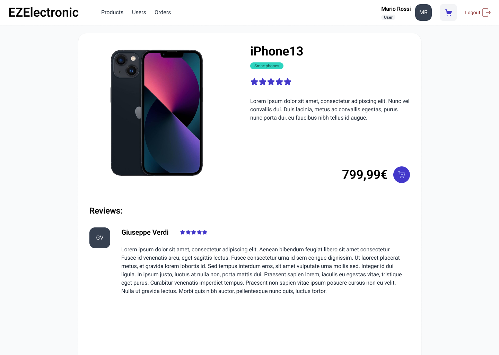
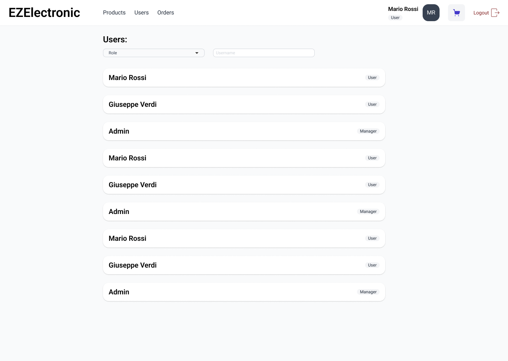

# Graphical User Interface Prototype - FUTURE

Authors:

Date:

Version:

## Registrazione

## Login

## Aggiungi Prodotto

In questa pagina un **Manager** può inserire un nuovo prodotto.

## Prodotti

Vi si accede dal link _Products_ della navbar. Nella pagina è mostrata una lista con le informazioni di base dei prodotti (node, descrizione, categoria, prezzo, immagine, rating) ed un bottone per aggiungere il prodotto selezionato al carrello. I prodotti possono essere filtrati per **Category**. In cima vengono mostrati in versione più compatta i prodotti raccomandati all'utente.

## Prodotto

Vi si accede con un click alla _Card_ di un prodotto. Qui viene mostrato un singolo prodotto assieme alle recensioni del suddetto.

## Carrello

Vi si accede facendo un click sull'icona del carrello della navbar (in alto a destra). Vengono mostarti i prodotti che un utente ha messo nel carrello ed un bottone per confermare l'ordine. Vi è la possibilità di selezionare quali prodotti verranno effettivamente ordinati tramite un checkbox e la possibilità di rimuoverne uno con il bottone rosso.

## Utenti

Vi si accede dal link _Users_ della navbar. Nella pagina è mostrata una lista di tutti gli utenti. Gli utenti possono essere filtrati per **Role** e **Username**.

## Ordini

Vi si accede dal link _Orders_ della navbar. Nella pagina viene mostrata una lista di tutti gli ordini effettuati da un utente. Ciascun ordine ha un bottone che permette di riordinare i prodotti del suddetto.

