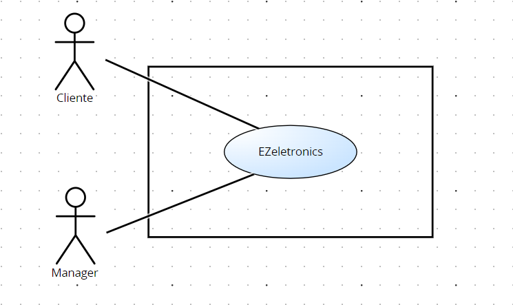
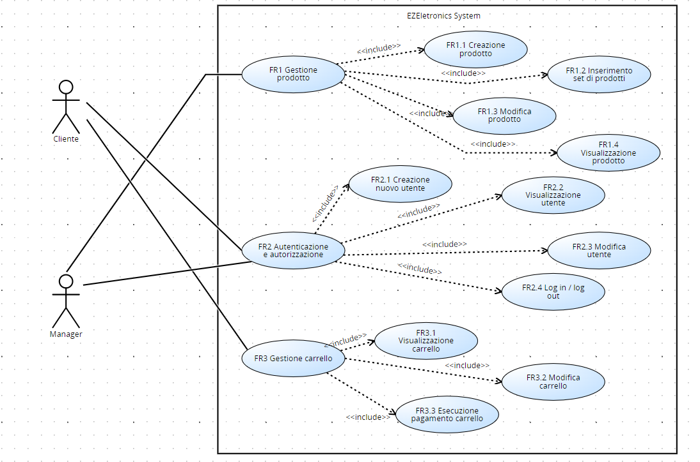

# Requirements Document - current EZElectronics

Date:

Version: V1 - description of EZElectronics in CURRENT form (as received by teachers)

| Version number | Change |
| :------------: | :----: |
|                |        |

# Contents

- [Requirements Document - current EZElectronics](#requirements-document---current-ezelectronics)
- [Contents](#contents)
- [Informal description](#informal-description)
- [Stakeholders](#stakeholders)
- [Context Diagram and interfaces](#context-diagram-and-interfaces)
  - [Context Diagram](#context-diagram)
  - [Interfaces](#interfaces)
- [Stories and personas](#stories-and-personas)
- [Functional and non functional requirements](#functional-and-non-functional-requirements)
  - [Functional Requirements](#functional-requirements)
  - [Non Functional Requirements](#non-functional-requirements)
- [Use case diagram and use cases](#use-case-diagram-and-use-cases)
  - [Use case diagram](#use-case-diagram)
    - [Use case 1, UC1](#use-case-1-uc1)
        - [Scenario 1.1](#scenario-11)
    - [Use case 1, UC1: Login](#use-case-1-uc1-login)
        - [Scenario 1.1](#scenario-11-1)
    - [Use case 2, UC: Logout](#use-case-2-uc-logout)
        - [Scenario 2.1](#scenario-21)
    - [Use case 3, UC3: Creazione nuovo utente](#use-case-3-uc3-creazione-nuovo-utente)
        - [Scenario 3.1](#scenario-31)
        - [Scenario 3.2](#scenario-32)
    - [Use case 4, UC4: Visualizzazione utente](#use-case-4-uc4-visualizzazione-utente)
        - [Scenario 4.1](#scenario-41)
        - [Scenario 4.2](#scenario-42)
        - [Scenario 4.3](#scenario-43)
        - [Scenario 4.4](#scenario-44)
    - [Use case 5, UC4: Modifica utente](#use-case-5-uc4-modifica-utente)
        - [Scenario 5.1](#scenario-51)
        - [Scenario 5.2](#scenario-52)
    - [Use case 6, UC6: Aggiunta prodotti](#use-case-6-uc6-aggiunta-prodotti)
        - [Scenario 6.1](#scenario-61)
        - [Scenario 6.2](#scenario-62)
        - [Scenario 6.3](#scenario-63)
        - [Scenario 6.4](#scenario-64)
    - [Use case 7, UC7: Modifica prodotto](#use-case-7-uc7-modifica-prodotto)
        - [Scenario 7.1](#scenario-71)
        - [Scenario 7.2](#scenario-72)
        - [Scenario 7.3](#scenario-73)
        - [Scenario 7.4](#scenario-74)
        - [Scenario 7.5](#scenario-75)
        - [Scenario 7.6](#scenario-76)
    - [Use case 8, UC8: Visualizzazione prodotti](#use-case-8-uc8-visualizzazione-prodotti)
        - [Scenario 8.1](#scenario-81)
        - [Scenario 8.2](#scenario-82)
    - [Use case 9, UC9: Visualizzazione carrello](#use-case-9-uc9-visualizzazione-carrello)
        - [Scenario 9.1](#scenario-91)
        - [Scenario 9.2](#scenario-92)
    - [Use case 10, UC10: Modifica carrello](#use-case-10-uc10-modifica-carrello)
        - [Scenario 10.1](#scenario-101)
        - [Scenario 10.2](#scenario-102)
        - [Scenario 10.3](#scenario-103)
        - [Scenario 10.4](#scenario-104)
        - [Scenario 10.5](#scenario-105)
        - [Scenario 10.6](#scenario-106)
        - [Scenario 10.7](#scenario-107)
- [Glossary](#glossary)
  - [UML Class Diagram](#uml-class-diagram)
  - [Table](#table)
- [System Design](#system-design)
- [Deployment Diagram](#deployment-diagram)

# Informal description

EZElectronics (read EaSy Electronics) is a software application designed to help managers of electronics stores to manage their products and offer them to customers through a dedicated website. Managers can assess the available products, record new ones, and confirm purchases. Customers can see available products, add them to a cart and see the history of their past purchases.

# Stakeholders

|   Stakeholder name    | Description |
|   :--------------:    | :---------: |
|        Cliente         | Cliente del sito web che visualizza i prodotti e può inserirli nel carrello           |
|        Manager        | Figura che gestisce l'inserimento, la modifica e la rimozione dei prodotti sul sito            |

# Context Diagram and interfaces

## Context Diagram

## Interfaces

|   Actor   | Logical Interface | Physical Interface |
| :-------: | :---------------: | :----------------: |
| Cliente | Smartphone / PC | GUI (tbd – mostrare i prodotti, riempire il carrello, visionare vecchi carrelli, modificare carrello, effettuare l’ordine, creazione / rimozione account, login / logout) |
| Manager | Smartphone / PC | GUI (tbd – inserire prodotti, modificare prodotti, creazione / rimozione account, login / logout) |

# Stories and personas

* **Persona 1:** donna, 25 anni, nubile, studentessa
  * **Storia:** ha bisogno di un nuovo tablet con cui studiare, il suo tablet attuale non funziona più. Deve trovare un nuovo tablet che abbia un *il costo più contenuto possibile*, anche con funzionalità limitate.
* **Persona 2:** uomo, 50 anni, sposato con figli, poliziotto
  * **Storia:** sta cercando un dispositivo gps per rilevare la posizione del proprio cane. Non ha problemi di budget, ma ha bisogno del *dispositivo con le migliori prestazioni*.
* **Persona 3:** donna, 70 anni, vedova, pensionata
  * **Storia:** è alla ricerca di una tv da usare durante il suo tempo libero. Le serve cercare su una *piattaforma facile da usare* per completare il suo acquisto. 
* **Persona 4:** uomo, 35 anni, sposato, con figli, informatico
  * **Storia:** ogni anno fa degli acquisti per la propria classe. Ha necessità di fare ordini molto spesso, quindi cerca una *piattaforma con un'interfaccia intuitiva* che gli faccia perdere meno tempo possibile.

# Functional and non functional requirements

## Functional Requirements

|  ID   | Description |
| :---: | :---------: |
|  **FR1**  | **Gestione prodotti** |
|  FR1.1  | Creazione prodotto |
|  FR1.2  | Inserimento set di prodotto |
|  FR1.3  | Modifica prodotto (contrassegna venduti, cancellazione di tutti i prodotti, cancellazione prodotto) |
|  FR1.4  | Visualizzazione prodotto (elenco prodotti, info su un prodotto, elenco prodotti di una categoria, elenco prodotti di un modello) |
|  **FR2**  | **Autenticazione e autorizzazione**            |
| FR2.1 | Creazione nuovo utente |
| FR2.2 | Visualizzazione utente (elenco utenti, elenco utenti con un ruolo, visualizzazione singolo utente, info utente loggato) |
| FR2.3 | Modifica utente (cancellazione utente) |
| FR2.4 | Login / logout utente |
|  **FR3**  | **Gestione carrello** |
| FR3.1 | Visualizzazione carrello (carrello attuale del cliente, fornire la cronologia dei carrelli pagati) |
| FR3.2 | Modifica carrello (aggiunta di un prodotto, rimozione di un prodotto, cancellazione del carrello, cancellazione di tutti i carrelli) |
| FR3.3 | Esecuzione del pagamento del carrello |

## Non Functional Requirements

|   ID    | Type (efficiency, reliability, ..) | Description | Refers to |
| :-----: | :--------------------------------: | :---------: | :-------: |
|  NFR1   | Usabilità | Gli utenti non devono avere bisogno di training per l'utilizzo del sito web | FR2, FR3|
|  NFR2   | Usabilità | Il sito deve essere facilmente accessibile e comprensibile | FR1, FR2, FR3|
|  NFR3   | Efficienza | Tutte le funzionalità del sito web devono completarsi in un tempo < 0.1 sec (escludendo la rete) | FR1, FR2, FR3|
|  NFR4   | Affidabilità | Ogni utente non deve segnalare più di un bug all’anno | FR2, FR3|
|  NFR5   | Affidabilità | Backup regolare dei dati per evitare malfunzionamenti e perdita / dispersione di dati | FR3|
|  NFR6   | Portabilità | Disponibilità del website su: Google Chrome, Safari, Mozilla Firefox per Windows 10 e 11 e macOS 14 | FR1, FR2, FR3|

# Use case diagram and use cases

## Use case diagram

### Use case 1, UC1: Creazione prodotto

| Actors involved | Manager |
| :-------------- | :------ |
| Precondition    | Manager loggato |
| Post condition  | Database dei prodotti aggiornato |
| Nominal scenario | 1.1, 1.2 |
| Variants | - |
| Exceptions | 1.3, 1.4 |

##### Scenario 1.1

| Scenario 1.1 | Creazione prodotto |
| :----------- | :----------------- |
| Precondition | Manager loggato |
| Post condition | Database dei prodotti aggiornato |
| Step# | Descrizione |
| 1 | Manager: chiede di inserire un prodotto |
| 2 | Sistema: chiede di inserire codice, prezzo di vendita, modello, categoria, eventuali dettagli e la data di arrivo |
| 3 | Manager: inserisce codice, prezzo di vendita, modello, categoria, eventuali dettagli e la data di arrivo |
| 4 | Sistema: crea un nuovo prodotto e lo memorizza nel database |

##### Scenario 1.2

| Scenario 1.2 | Inserimento set di prodotti |
| :----------- | :------------------------ |
| Precondition | Manager loggato |
| Post condition | Database dei prodotti aggiornato |
| Step# | Descrizione |
| 1 | Manager: chiede di inserire un insieme di prodotti |
| 2 | Sistema: chiede di inserire modello, categoria, dettagli eventuali, quantità, data di arrivo e prezzo di vendita |
| 3 | Manager: inserisce modello, categoria, dettagli eventuali, quantità, data di arrivo e prezzo di vendita |
| 4 | Sistema: aggiorna il database |

##### Scenario 1.3

| Scenario 1.3 | Prodotto già presente nel database |
| :----------- | :--------------------------------- |
| Precondition | Manager loggato |
| Post condition | Inserimento del prodotto fallito |
| Step# | Descrizione |
| 1 | Manager: chiede di inserire un prodotto |
| 2 | Sistema: chiede di inserire modello, categoria, dettagli eventuali, quantità, data di arrivo e prezzo di vendita |
| 3 | Manager: inserisce un codice di un prodotto già presente nel database |
| 4 | Sistema: ritorna errore 409 |

##### Scenario 1.4

| Scenario 1.4 | Data di arrivo dopo il giorno attuale |
| :----------- | :------------------------------------ |
| Precondition | Manager loggato |
| Post condition | Inserimento del prodotto fallito |
| Step# | Descrizione |
| 1 | Manager: chiede di inserire un prodotto o un set di prodotti |
| 2 | Sistema: chiede di inserire i campi |
| 3 | Manager: inserisce una data di arrivo per quel prodotto successiva a quella attuale |
| 4 | Sistema: ritorna errore |

### Use case 2, UC2: Modifica prodotto 

| Actors involved | Manager |
| :-------------- | :------ |
| Precondition    | Manager loggato |
| Post condition  | Database dei prodotti aggiornato |
| Nominal scenario | 2.1, 2.5|
| Variants | - |
| Exceptions | 2.2, 2.3, 2.4, 2.6|

##### Scenario 2.1

| Scenario 2.1 | Segnare un prodotto come venduto |
| :----------- | :------------------------------- |
| Precondition | Manager loggato |
| Post condition | Prodotto venduto |
| Step# | Descrizione |
| 1 | Manager: chiede di marcare un prodotto come venduto |
| 2 | Sistema: chiede di inserire il codice del prodotto e la data di vendita opzionalmente |
| 3 | Manager: inserisce il codice del prodotto da segnare come venduto e una eventuale data di vendita |
| 4 | Sistema: marca il prodotto come venduto |

##### Scenario 2.2

| Scenario 2.2 | Si cerca un prodotto che non è però presente |
| :----------- | :------------------------------------------ |
| Precondition | Manager loggato |
| Post condition | Operazione fallita |
| Step# | Descrizione |
| 1 | Manager: chiede di marcare un prodotto come venduto |
| 2 | Sistema: chiede di inserire il codice del prodotto e la data di vendita opzionalmente |
| 3 | Manager: inserisce il codice di un prodotto non presente nel database |
| 4 | Sistema: ritorna un 404 error |

##### Scenario 2.3

| Scenario 2.3 | Data di vendita inserita non valida |
| :----------- | :---------------------------------- |
| Precondition | Manager loggato |
| Post condition | Operazione fallita |
| Step# | Descrizione |
| 1 | Manager: chiede di marcare un prodotto come venduto |
| 2 | Sistema: chiede di inserire il codice del prodotto e la data di vendita opzionalmente |
| 3 | Manager: inserisce una data di vendita successiva a quella attuale o precedente a quella di arrivo |
| 4 | Sistema: ritorna un error |

##### Scenario 2.4

| Scenario 2.4 | Prodotto già segnato come venduto |
| :----------- | :--------------------------------- |
| Precondition | Manager loggato |
| Post condition | Operazione fallita |
| Step# | Descrizione |
| 1 | Manager: chiede di marcare un prodotto come venduto |
| 2 | Sistema: chiede di inserire il codice del prodotto e la data di vendita opzionalmente |
| 3 | Manager: inserisce un codice di prodotto già segnato come venduto |
| 4 | Sistema: ritorna un error |

##### Scenario 2.5

| Scenario 2.5 | Eliminazione di un prodotto |
| :----------- | :--------------------------------- |
| Precondition | Manager loggato |
| Post condition | Eliminazione del prodotto dal database |
| Step# | Descrizione |
| 1 | Manager: chiede di eliminare un prodotto |
| 2 | Sistema: chiede di inserire il codice del prodotto |
| 3 | Manager: inserisce il codice del prodotto  |
| 4 | Sistema: toglie il prodotto dal database |

##### Scenario 2.6

| Scenario 2.6 | Eliminazione di un prodotto già assente dal database |
| :----------- | :--------------------------------- |
| Precondition | Manager loggato |
| Post condition | Eliminazione del prodotto dal database |
| Step# | Descrizione |
| 1 | Manager: chiede di eliminare un prodotto |
| 2 | Sistema: chiede di inserire il codice del prodotto |
| 3 | Manager: inserisce il codice di un prodotto assente nel database  |
| 4 | Sistema: ritorna 404 error |

### Use case 3, UC3: Visualizzazione prodotti

| Actors involved | Utente |
| :-------------- | :------ |
| Precondition    | Utente loggato |
| Post condition  | visualizzazione dei prodotti nel database |
| Nominal scenario | 3.1, 3.2 |
| Variants | - |
| Exceptions ||

##### Scenario 3.1

| Scenario 3.1 | Visualizzazione di tutti i prodotti |
| :----------- | :---------------------------------- |
| Precondition | Utente loggato |
| Post condition | Visualizzazione di tutti i prodotti nel database |
| Step# | Descrizione |
| 1 | Utente: accede al catalogo |
| 2 | Sistema: chiede di inserire il codice del prodotto e la data di vendita opzionalmente |
| 3 | Manager: inserisce un codice di prodotto già segnato come venduto |
| 4 | Sistema: ritorna un error |

##### Scenario 3.2

| Scenario 3.2 | Visualizzazione dei prodotti di una categoria o modello |
| :----------- | :---------------------------------- |
| Precondition | Utente loggato |
| Post condition | Visualizzazione di tutti i prodotti nel database di una certa gategoria o modello |
| Step# | Descrizione |
| 1 | Utente: accede al catalogo |
| 2 | Sistema: chiede di inserire il modello o la categoria dei prodotti |
| 3 | Manager: inserisce il modello o la categoria dei prodotti da vedere|
| 4 | Sistema: ritorna l'elenco dei prodotti di quella categoria o modello |

### Use case 4, UC4: Creazione nuovo utente

| Actors Involved  |  Utente     |
| :--------------: | :------------------------------------------------------------------: |
|   Precondition   | Utente non registrato |
|  Post condition  |  Utente registrato  |
| Nominal Scenario | Scenario 4.1   |
|    Varianti     |                      No             |
|    Eccezioni    |  Scenario 4.2 |

##### Scenario 4.1

|  Scenario 4.1  |  Creazione account  |
| :------------: | :------------------------------------------------------------------------: |
|  Precondition  | Utente non registrato |
| Post condition |  Utente registrato  |
|     Step#      |               Descrizione    |
|       1        |   Utente: fornisce dati per la registrazione (username, name, surname, password, ruolo)  |
|       2        |   Sistema: elabora le informazioni e permette la registrazione dell'account  |

##### Scenario 4.2

|  Scenario 4.2  |  Utente già registrato  |
| :------------: | :------------------------------------------------------------------------: |
|  Precondition  | Utente registrato |
| Post condition |  Utente registrato  |
|     Step#      |               Descrizione    |
|       1        |   Utente: fornisce dati per la registrazione (username, name, surname, password, ruolo)   |
|       2        |   Sistema: elabora le richiesta e npon permette la registrazione, l'utente è già registrato  |

### Use case 5, UC5: Visualizzazione utente

| Actors Involved  |  Utente     |
| :--------------: | :------------------------------------------------------------------: |
|   Precondition   | Utente loggato, ricerca informazioni su altri utenti |
|  Post condition  |  Visualizzazione informazioni  |
| Nominal Scenario | Scenario 5.1, 5.2, 5.3   |
|    Varianti     |                      No             |
|    Eccezioni    |  Scenario 5.4 |

##### Scenario 5.1

|  Scenario 5.1  |  Visualizzazione lista di tutti gli utenti  |
| :------------: | :------------------------------------------------------------------------: |
|  Precondition  | Utente loggato, ricerca informazioni su altri utenti |
| Post condition |  Visualizzazione informazioni di tutti gli utenti  |
|     Step#      |               Descrizione    |
|       1        |   Utente: richiede informazioni di tutti gli utenti  |
|       2        |   Sistema: elabora la richiesta e fornisce una lista con tutte le informazioni di tutti gli utenti (username, name, surname, password, ruolo)  |

##### Scenario 5.2

|  Scenario 5.2  |  Visualizzazione informazioni degli utenti per ruolo  |
| :------------: | :------------------------------------------------------------------------: |
|  Precondition  | Utente loggato, ricerca informazioni su altri utenti |
| Post condition |  Visualizzazione informazioni degli utenti per ruolo  |
|     Step#      |               Descrizione    |
|       1        |   Utente: richiede informazioni di tutti i clienti oppure di tutti i managers  |
|       2        |   Sistema: elabora la richiesta e fornisce una lista con tutte le informazioni di tutti i clienti oppure di tutti i managers (username, name, surname, password, ruolo) |

##### Scenario 5.3

|  Scenario 5.3  |  Visualizzazione utente con specifico username  |
| :------------: | :------------------------------------------------------------------------: |
|  Precondition  | Utente loggato, ricerca informazioni su altri utenti |
| Post condition | Visualizzazione informazioni dell'utente richiesto  |
|     Step#      |               Descrizione    |
|       1        |   Utente: richiede informazioni di un utente inserendo il suo username  |
|       2        |   Sistema: elabora le informazioni e fornisce le informazioni dell'utente richiesto (username, name, surname, password, ruolo)  |

##### Scenario 5.4

|  Scenario 5.4  |  Utente non presente nel database  |
| :------------: | :------------------------------------------------------------------------: |
|  Precondition  | Utente loggato, ricerca informazioni su altri utenti |
| Post condition |  Nessuna visualizzazione  |
|     Step#      |               Descrizione    |
|       1        |   Utente: richiede informazioni di un utente inserendo il suo username   |
|       2        |   Sistema: elabora le informazioni e non permette nessuna visualizzazione, l'utente non esiste con quel username  |

### Use case 6, UC6: Modifica utente

| Actors Involved  |  Utente  |
| :--------------: | :------------------------------------------------------------------: |
|   Precondition   | Utente gestisce gli account |
|  Post condition  | Account richiesto eliminato  |
| Nominal Scenario | Scenario 6.1 |
|    Varianti     |                      No             |
|    Eccezioni    | Scenario 6.2 |

##### Scenario 6.1

|  Scenario 6.1  | Eliminazione di uno specifico utente a partire dal username  |
| :------------: | :------------------------------------------------------------------------: |
|  Precondition  | Utente non loggato gestisce gli account |
| Post condition |  Account richiesto eliminato |
|     Step#      |               Descrizione    |
|       1        |   Utente: richiede la cancellazione di un account fornendo lo username  |
|       2        |   Sistema: elabora la richiesta ed elimina l'account  |

##### Scenario 6.2

|  Scenario 6.2  |  Username non esiste  |
| :------------: | :------------------------------------------------------------------------: |
|  Precondition  |  Utente non loggato gestisce gli account |
| Post condition |   Account richiesto non eliminato |
|     Step#      |               Descrizione    |
|       1        |   Admin: richiede la cancellazione di un account fornendo lo username  |
|       2        |   Sistema: elabora la richiesta e non elimina l'account, lo username richiesto non esiste |

### Use case 7, UC7: Login

| Actors Involved  |  Utente  |
| :--------------: | :------------------------------------------------------------------: |
|   Precondition   | Utente registrato e non loggato |
|  Post condition  |  Utente loggato  |
| Nominal Scenario |   Scenario 7.1  |
|     Variants     |   No    |
|    Exceptions    |   No   |

##### Scenario 7.1

|  Scenario 7.1  |  Login  |
| :------------: | :------------------------------------------------------------------------: |
|  Precondition  | Utente registrato e non loggato |
| Post condition |  Utente loggato  |
|     Step#      |               Descrizione    |
|       1        |   Sistema: richiede email e password   |
|       2        |   Utente: fornisce email e password  |
|      3      |   Sistema: elabora le informazioni e autorizza l’utente a fare login |

### Use case 8, UC8: Logout

| Actors Involved  |  Utente     |
| :--------------: | :------------------------------------------------------------------: |
|   Precondition   | Utente loggato |
|  Post condition  |  Utente non loggato  |
| Nominal Scenario | Scenario 8.1   |
|    Varianti     |                      No             |
|    Eccezioni    |    No   |

##### Scenario 8.1

|  Scenario 8.1  |  Logout  |
| :------------: | :------------------------------------------------------------------------: |
|  Precondition  | Utente loggato |
| Post condition |  Utente non loggato  |
|     Step#      |               Descrizione    |
|       1        |   Utente: richiede logout   |
|       2        |   Sistema: elabora la richiesta e permette il logout  |

### Use case 9, UC9: Visualizzazione carrello

| Actors involved | Cliente |
| :-------------- | :------ |
| Precondition    | Cliente loggato |
| Post condition  | Visualizzazione dei prodotti di un carrello |
| Nominal scenario | 9.1, 9.2 |
| Variants | - |
| Exceptions |  |

##### Scenario 9.1

| Scenario 9.1 | Visualizzazione del carrello attuale |
| :----------- | :----------------- |
| Precondition | Cliente loggato |
| Post condition | Visualizzazione del carrello attuale dell'utente loggato |
| Step# | Descrizione |
| 1 | Cliente: chiede di visualizzare il carrello |
| 2 | Sistema: torna l'elenco dei prodotti presenti nel carrello |

##### Scenario 9.2

| Scenario 9.2 | Visualizzazione della storia dei carrelli già pagati |
| :----------- | :----------------- |
| Precondition | Cliente loggato |
| Post condition | Visualizzazione dei carrelli già pagati dal cliente |
| Step# | Descrizione |
| 1 | Cliente: chiede di visualizzare i carrelli |
| 2 | Sistema: torna l'elenco dei vecchi carrelli già pagati |

### Use case 10, UC10: Modifica carrello

| Actors involved | Cliente |
| :-------------- | :------ |
| Precondition    | Cliente loggato |
| Post condition  | Modifica del carrello |
| Nominal scenario | 10.1, 10.5, 10.7 |
| Variants | - |
| Exceptions | 10.2, 10.3, 10.4, 10.6 |

##### Scenario 10.1

| Scenario 10.1 | Aggiunta di un prodotto |
| :----------- | :----------------- |
| Precondition | Cliente loggato |
| Post condition | Aggiunta di un prodotto al carrello |
| Step# | Descrizione |
| 1 | Cliente: chiede di inserire il prodotto al carrello |
| 2 | Sistema: chiede id del prodotto  |
| 3 | cliente: inserisce id del prodotto  |
| 4 | sistema: aggiunge il prodotto all'elenco dei prodotti del carrello attuale |

##### Scenario 10.2

| Scenario 10.2 | Il prodotto non può essere aggiunto o rimosso  |
| :----------- | :----------------- |
| Precondition | Cliente loggato |
| Post condition | Sistema ritorna errore |
| Step# | Descrizione |
| 1 | Cliente: chiede di inserire o rimuovere il prodotto al carrello |
| 2 | Sistema: chiede id del prodotto  |
| 3 | cliente: inserisce un id relativo ad un prodotto già venduto |
| 4 | sistema: ritorna 409 error |

##### Scenario 10.3

| Scenario 10.3 | Il prodotto non può essere rimosso  |
| :----------- | :----------------- |
| Precondition | Cliente loggato |
| Post condition | Sistema ritorna errore |
| Step# | Descrizione |
| 1 | Cliente: chiede di inserire il prodotto al carrello |
| 2 | Sistema: chiede id del prodotto  |
| 3 | cliente: inserisce un id relativo ad un prodotto non nel carrello o presente in un altro carrello |
| 4 | sistema: ritorna 404 error |

##### Scenario 10.4

| Scenario 10.4 | Id del prodotto non valido |
| :----------- | :----------------- |
| Precondition | Cliente loggato |
| Post condition | Sistema ritorna errore |
| Step# | Descrizione |
| 1 | Cliente: chiede di inserire o rimuovere il prodotto nel carrello |
| 2 | Sistema: chiede id del prodotto  |
| 3 | cliente: inserisce un id non valido    |
| 4 | sistema: ritorna 404 error |

##### Scenario 10.5

| Scenario 10.5 | Rimozione prodotto |
| :----------- | :----------------- |
| Precondition | Cliente loggato |
| Post condition | Sistema toglie il prodotto dal carrello |
| Step# | Descrizione |
| 1 | Cliente: chiede di rimuovere il prodotto al carrello |
| 2 | Sistema: chiede id del prodotto  |
| 3 | cliente: inserisce un id valido  |
| 4 | sistema: toglie il prodotto dal carrello |

##### Scenario 10.6

| Scenario 10.6 | Carrello non esiste |
| :----------- | :----------------- |
| Precondition | Cliente loggato |
| Post condition | Sistema ritorna errore |
| Step# | Descrizione |
| 1 | Cliente: chiede di rimuovere il prodotto dal carrello o di eliminare il carello |
| 2 | Sistema: ritorna error 404 perchè non esiste un carrello |

##### Scenario 10.7

| Scenario 10.7 | Eliminazione carrello corrente |
| :----------- | :----------------- |
| Precondition | Cliente loggato |
| Post condition | Sistema elimina il carrello |
| Step# | Descrizione |
| 1 | Cliente: chiede di rimuovere il carrello|
| 2 | Sistema: elimina il carrello |

## Glossary

## Table

  1. **Utente**: un utente caratterizzato dal assegnazione di uno tra due ruoli:
     - **Manager**: utente che gestisce i prodotti all'interno del magazzino (inserendo i nuovi prodotti arrivati, eliminando quelli non più disponibili, gestendo l'invio dei prodotti acquistati dai customer)
     - **Cliente**: colui che effettua un qualunque acquisto sul sito, tramite diversi metodi di pagamento, inserendo i prodotti scelti nel carrello.
  1. **Prodotto**: prodotto disponibile attraverso il sito, che può essere acquistato nel caso in cui sia ancora presente in stock o non sia stato ancora acquistato da un'altro utente.
  1. **Carrello**: lista di prodotti scelti dal utente per essere acquistati. Un prodotto può essere inserito nel carrello e poi acquistato in due momenti diversi.
     - **Acquisto**: momento in cui si comprano i prodotti inseriti nel carrello.

# System Design

# Deployment Diagram

