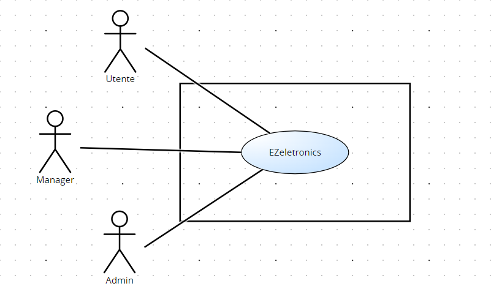

# Requirements Document - current EZElectronics

Date:

Version: V1 - description of EZElectronics in CURRENT form (as received by teachers)

| Version number | Change |
| :------------: | :----: |
|                |        |

# Contents

- [Requirements Document - current EZElectronics](#requirements-document---current-ezelectronics)
- [Contents](#contents)
- [Informal description](#informal-description)
- [Stakeholders](#stakeholders)
- [Context Diagram and interfaces](#context-diagram-and-interfaces)
  - [Context Diagram](#context-diagram)
  - [Interfaces](#interfaces)
- [Stories and personas](#stories-and-personas)
- [Functional and non functional requirements](#functional-and-non-functional-requirements)
  - [Functional Requirements](#functional-requirements)
  - [Non Functional Requirements](#non-functional-requirements)
- [Use case diagram and use cases](#use-case-diagram-and-use-cases)
  - [Use case diagram](#use-case-diagram)
    - [Use case 1, UC1](#use-case-1-uc1)
      - [Scenario 1.1](#scenario-11)
      - [Scenario 1.2](#scenario-12)
      - [Scenario 1.x](#scenario-1x)
    - [Use case 2, UC2](#use-case-2-uc2)
    - [Use case x, UCx](#use-case-x-ucx)
- [Glossary](#glossary)
- [System Design](#system-design)
- [Deployment Diagram](#deployment-diagram)

# Informal description

EZElectronics (read EaSy Electronics) is a software application designed to help managers of electronics stores to manage their products and offer them to customers through a dedicated website. Managers can assess the available products, record new ones, and confirm purchases. Customers can see available products, add them to a cart and see the history of their past purchases.

# Stakeholders

|   Stakeholder name    | Description |
|   :--------------:    | :---------: |
|        Cliente         | Cliente del sito web che visualizza i prodotti e può inserirli nel carrello           |
|        Manager        | Figura che gestisce l'inserimento, la modifica e la rimozione dei prodotti sul sito            |
|      Admin     | Figura che progetta e programma il software            |
| Servizio di Pagamento | Servizio che consente la transazione per l'acquisto dei prodotti del carrello            |

# Context Diagram and interfaces

## Context Diagram

## Interfaces

|   Actor   | Logical Interface | Physical Interface |
| :-------: | :---------------: | :----------------: |
| Cliente | Smartphone / PC | GUI (tbd – mostrare i prodotti, riempire il carrello, visionare vecchi carrelli, modificare carrello, effettuare l’ordine) |
| Manager | Smartphone / PC | GUI (tbd – inserire prodotti, modificare prodotti) |
| Admin | PC | GUI (tbd – tutte le funzionalità precedenti e gestione account) |
| Servizio di Pagamento | Internet | Link al sito del servizio di pagamento |

# Stories and personas

* **Persona 1:** donna, 25 anni, nubile, studentessa
  * **Storia:** ha bisogno di un nuovo tablet con cui studiare, il suo tablet attuale non funziona più. Deve trovare un nuovo tablet che abbia un *il costo più contenuto possibile*, anche con funzionalità limitate.
* **Persona 2:** uomo, 50 anni, sposato con figli, poliziotto
  * **Storia:** sta cercando un dispositivo gps per rilevare la posizione del proprio cane. Non ha problemi di budget, ma ha bisogno del *dispositivo con le migliori prestazioni*.
* **Persona 3:** donna, 70 anni, vedova, pensionata
  * **Storia:** è alla ricerca di una tv da usare durante il suo tempo libero. Le serve cercare su una *piattaforma facile da usare* per completare il suo acquisto. 
* **Persona 4:** uomo, 35 anni, sposato, con figli, informatico
  * **Storia:** ogni anno fa degli acquisti per la propria classe. Ha necessità di fare ordini molto spesso, quindi cerca una *piattaforma con un'interfaccia intuitiva* che gli faccia perdere meno tempo possibile.

# Functional and non functional requirements

## Functional Requirements

|  ID   | Description |
| :---: | :---------: |
|  **FR1**  | **Gestione prodotti** |
|  FR1.1  | Creazione prodotti |
|  FR1.2  | Inserimento set di prodotti |
|  FR1.3  | Modifica prodotto (contrassegna venduti, cancellazione di tutti i prodotti, cancellazione prodotto) |
|  FR1.4  | Visualizzazione prodotti (elenco prodotti, info su un prodotto, elenco prodotti di una categoria, elenco prodotti di un modello) |
|  **FR2**  | **Autenticazione e autorizzazione**            |
| FR2.1 | Creazione nuovo cliente |
| FR2.2 | Visualizzazione clienti (elenco clienti, elenco clienti con un ruolo, visualizzazione singolo cliente, info cliente loggato) |
| FR2.3 | Modifica utenti (cancellazione utenti, cancellazione utente) |
| FR2.4 | Login / logout utenti |
|  **FR3**  | **Gestione carrello** |
| FR3.1 | Visualizzazione carrello (carrello attuale dell’utente, fornire la cronologia dei carrelli pagati) |
| FR3.2 | Modifica carrello (aggiunta di un prodotto, rimozione di un prodotto, cancellazione del carrello, cancellazione di tutti i carrelli) |
| FR3.3 | Esecuzione del pagamento del carrello |
|  **FR4**  | **Controllo prezzi** |
| FR4.1 | Gestione aggiornamento prezzi |
|  **FR5**  | **Gestione dei pagamenti** |
| FR5.1 | Richiesta pagamento |
| FR5.2 | Gestione dati di pagamento |

## Non Functional Requirements

|   ID    | Type (efficiency, reliability, ..) | Description | Refers to |
| :-----: | :--------------------------------: | :---------: | :-------: |
|  NFR1   | Usabilità | Gli utenti non devono avere bisogno di training per l'utilizzo del sito web | FR2, FR3, FR5 |
|  NFR2   | Usabilità | Il sito deve essere facilmente accessibile e comprensibile | FR1, FR2, FR3, FR5 |
|  NFR3   | Efficienza | Tutte le funzionalità del sito web devono completarsi in un tempo < 0.1 sec (escludendo la rete) | FR1, FR2, FR3, FR4, FR5 |
|  NFR4   | Affidabilità | Ogni utente non deve segnalare più di un bug all’anno | FR2, FR3, FR5 |
|  NFR5   | Affidabilità | Backup regolare dei dati per evitare malfunzionamenti e perdita / dispersione di dati | FR3, FR4 |
|  NFR6   | Portabilità | Disponibilità del website su: Google Chrome, Safari, Mozilla Firefox per Windows 10 e 11 e macOS 14 | FR1, FR2, FR3, FR4, FR5 |

# Use case diagram and use cases

## Use case diagram

\<define here UML Use case diagram UCD summarizing all use cases, and their relationships>

\<next describe here each use case in the UCD>

### Use case 1, UC1

| Actors Involved  |                                                                      |
| :--------------: | :------------------------------------------------------------------: |
|   Precondition   | \<Boolean expression, must evaluate to true before the UC can start> |
|  Post condition  |  \<Boolean expression, must evaluate to true after UC is finished>   |
| Nominal Scenario |         \<Textual description of actions executed by the UC>         |
|     Variants     |                      \<other normal executions>                      |
|    Exceptions    |                        \<exceptions, errors >                        |

##### Scenario 1.1

\<describe here scenarios instances of UC1>

\<a scenario is a sequence of steps that corresponds to a particular execution of one use case>

\<a scenario is a more formal description of a story>

\<only relevant scenarios should be described>

|  Scenario 1.1  |                                                                            |
| :------------: | :------------------------------------------------------------------------: |
|  Precondition  | \<Boolean expression, must evaluate to true before the scenario can start> |
| Post condition |  \<Boolean expression, must evaluate to true after scenario is finished>   |
|     Step#      |                                Description                                 |
|       1        |                                                                            |
|       2        |                                                                            |
|      ...       |                                                                            |

##### Scenario 1.2

##### Scenario 1.x

### Use case 2, UC2

..

### Use case x, UCx

..

# Glossary

## UML Class Diagram

## Table

  1. **User**: un utente caratterizzato dal assegnazione di uno tra due ruoli:
     - **Menager**: utente che gestisce i prodotti all'interno del magazzino (inserendo i nuovi prodotti arrivati, eliminando quelli non più disponibili)
     - **Customer**: colui che effettua un qualunque acquisto sul sito, tramite diversi metodi di pagamento, inserendo i prodotti scelti nel carrello.
  1. **Product**: prodotto disponibile attraverso il sito, che può essere acquistato nel caso in cui sia ancora presente in stock o non sia stato ancora acquistato da un'altro utente.
  1. **Carrello**: lista di prodotti scelti dal utente per essere acquistati. Un prodotto può essere inserito nel carrello e poi acquistato in due momenti diversi.
     - **Acquisto**: momento in cui si comprano i prodotti inseriti nel carrello.

# System Design

\<describe here system design>

\<must be consistent with Context diagram>

# Deployment Diagram

\<describe here deployment diagram >
