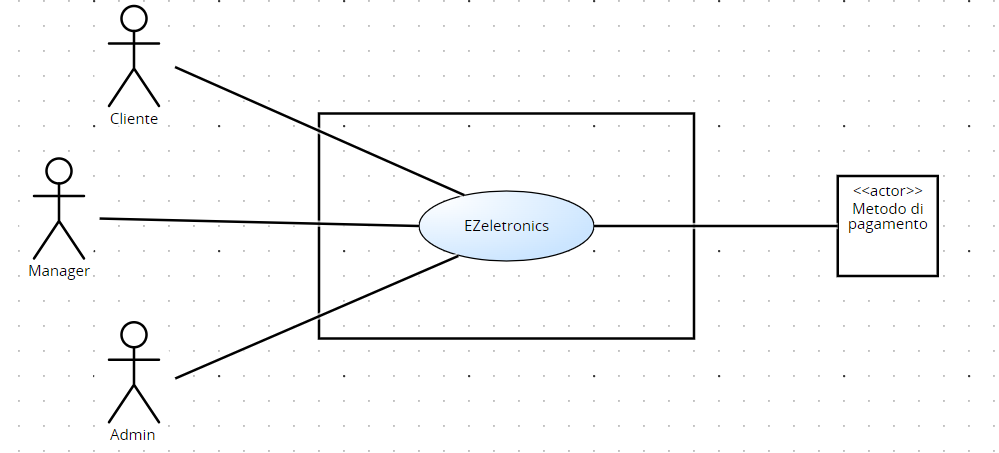

# Requirements Document - future EZElectronics

Date:

Version: V1 - description of EZElectronics in FUTURE form (as proposed by the team)

| Version number | Change |
| :------------: | :----: |
|                |        |

# Contents

- [Requirements Document - future EZElectronics](#requirements-document---future-ezelectronics)
- [Contents](#contents)
- [Informal description](#informal-description)
- [Stakeholders](#stakeholders)
- [Context Diagram and interfaces](#context-diagram-and-interfaces)
  - [Context Diagram](#context-diagram)
  - [Interfaces](#interfaces)
- [Stories and personas](#stories-and-personas)
- [Functional and non functional requirements](#functional-and-non-functional-requirements)
  - [Functional Requirements](#functional-requirements)
  - [Non Functional Requirements](#non-functional-requirements)
- [Use case diagram and use cases](#use-case-diagram-and-use-cases)
  - [Use case diagram](#use-case-diagram)
    - [Use case 1, UC1](#use-case-1-uc1)
        - [Scenario 1.1](#scenario-11)
        - [Scenario 1.2](#scenario-12)
        - [Scenario 1.3](#scenario-13)
        - [Scenario 1.4](#scenario-14)
    - [Use case 2, UC2: Modifica prodotto](#use-case-2-uc2-modifica-prodotto)
        - [Scenario 2.1](#scenario-21)
        - [Scenario 2.2](#scenario-22)
        - [Scenario 2.3](#scenario-23)
        - [Scenario 2.4](#scenario-24)
        - [Scenario 2.5](#scenario-25)
        - [Scenario 2.6](#scenario-26)
    - [Use case 3, UC3: Visualizzazione prodotti](#use-case-3-uc3-visualizzazione-prodotti)
        - [Scenario 3.1](#scenario-31)
        - [Scenario 3.2](#scenario-32)
    - [Use case 4, UC4: Creazione nuovo utente](#use-case-4-uc4-creazione-nuovo-utente)
        - [Scenario 4.1](#scenario-41)
        - [Scenario 4.2](#scenario-42)
    - [Use case 5, UC5: Visualizzazione utente](#use-case-5-uc5-visualizzazione-utente)
        - [Scenario 5.1](#scenario-51)
        - [Scenario 5.2](#scenario-52)
        - [Scenario 5.3](#scenario-53)
        - [Scenario 5.4](#scenario-54)
    - [Use case 6, UC6: Modifica utente](#use-case-6-uc6-modifica-utente)
        - [Scenario 6.1](#scenario-61)
        - [Scenario 6.2](#scenario-62)
    - [Use case 7, UC7: Login](#use-case-7-uc7-login)
        - [Scenario 7.1](#scenario-71)
    - [Use case 8, UC8: Logout](#use-case-8-uc8-logout)
        - [Scenario 8.1](#scenario-81)
    - [Use case 9, UC9: Visualizzazione carrello](#use-case-9-uc9-visualizzazione-carrello)
        - [Scenario 9.1](#scenario-91)
        - [Scenario 9.2](#scenario-92)
        - [Scenario 9.3](#scenario-93)
    - [Use case 10, UC10: Modifica carrello](#use-case-10-uc10-modifica-carrello)
        - [Scenario 10.1](#scenario-101)
        - [Scenario 10.2](#scenario-102)
        - [Scenario 10.3](#scenario-103)
        - [Scenario 10.4](#scenario-104)
        - [Scenario 10.5](#scenario-105)
        - [Scenario 10.6](#scenario-106)
        - [Scenario 10.7](#scenario-107)
    - [Use case 11, UC3: Gestione recensione](#use-case-11-uc3-gestione-recensione)
        - [Scenario 11.1](#scenario-111)
        - [Scenario 11.2](#scenario-112)
        - [Scenario 11.3](#scenario-113)
- [Glossary](#glossary)
- [System Design](#system-design)
- [Deployment Diagram](#deployment-diagram)

# Informal description

EZElectronics (read EaSy Electronics) is a software application designed to help managers of electronics stores to manage their products and offer them to customers through a dedicated website. Managers can assess the available products, record new ones, and confirm purchases. Customers can see available products, add them to a cart and see the history of their past purchases.

# Stakeholders

|   Stakeholder name    | Description |
|   :--------------:    | :---------: |
|        Cliente         | Cliente del sito web che visualizza i prodotti e può inserirli nel carrello           |
|        Manager        | Figura che gestisce l'inserimento, la modifica e la rimozione dei prodotti sul sito            |
|        Admin           | Sviluppatore che gestisce la creazione e accesso dell'utente           |
|  Metodo di pagamento  | Servizio che permette il pagamento dell'ordine online attraverso una piattaforma esterna        |

# Context Diagram and interfaces

## Context Diagram

## Interfaces

|   Actor   | Logical Interface | Physical Interface |
| :-------: | :---------------: | :----------------: |
| Cliente | Smartphone / PC | GUI (tbd – mostrare i prodotti, riempire il carrello, visionare vecchi carrelli, modificare carrello, effettuare l’ordine, login / logout) |
| Manager | Smartphone / PC | GUI (tbd – inserire prodotti, modificare prodotti, login / logout) |
| Admin | PC | GUI (tbd – creazione / rimozione account) |
| Metodo di pagamento | Internet | http://satispay.com/... |

# Stories and personas

* **Persona 1:** donna, 25 anni, nubile, studentessa
  * **Storia:** ha bisogno di un nuovo tablet con cui studiare, il suo tablet attuale non funziona più. Deve trovare un nuovo tablet che abbia un *il costo più contenuto possibile*, anche con funzionalità limitate.
* **Persona 2:** uomo, 50 anni, sposato con figli, poliziotto
  * **Storia:** sta cercando un dispositivo gps per rilevare la posizione del proprio cane. Non ha problemi di budget, ma ha bisogno del *dispositivo con le migliori prestazioni*.
* **Persona 3:** donna, 70 anni, vedova, pensionata
  * **Storia:** è alla ricerca di una tv da usare durante il suo tempo libero. Le serve cercare su una *piattaforma facile da usare* per completare il suo acquisto. 
* **Persona 4:** uomo, 35 anni, sposato, con figli, docente
<<<<<<< HEAD
  * **Storia:** ogni anno fa degli acquisti per la propria classe. Ha necessità di fare ordini molto spesso, quindi cerca una *piattaforma con un'interfaccia intuitiva* che gli faccia perdere meno tempo possibile e con cui poter fare degli ordini *periodici*.
* **Persona 5:** donna, 40 anni, sposata, con figli, medico
  *  **Storia:** sta cercando un regalo da fare a sua figlia e vorrebbe *conoscere le opinioni di altri utenti* riguardo diversi prodotti.
=======
  * **Storia:** ogni anno fa degli acquisti per la propria classe. Ha necessità di fare ordini molto spesso, quindi cerca una *piattaforma con un'interfaccia intuitiva* che gli faccia perdere meno tempo possibile.
  * **Persona 5:** 
  * **Storia:** .
>>>>>>> db3e56e640f265a31ec238c05aa10c342576da27

# Functional and non functional requirements

## Functional Requirements

|  ID   | Description |
| :---: | :---------: |
|  **FR1**  | **Gestione prodotti** |
|  FR1.1  | Creazione prodotto |
|  FR1.2  | Inserimento set di prodotto |
|  FR1.3  | Modifica prodotto (contrassegna venduti, cancellazione di tutti i prodotti, cancellazione prodotto) |
|  FR1.4  | Visualizzazione prodotto (elenco prodotti, info su un prodotto, elenco prodotti di una categoria, elenco prodotti di un modello) |
|  **FR2**  | **Autenticazione e autorizzazione**            |
| FR2.1 | Creazione nuovo utente |
| FR2.2 | Visualizzazione utente (visualizzazione singolo utente, info utente loggato) |
| FR2.3 | Modifica utente |
| FR2.4 | Login / logout utente |
|  **FR3**  | **Gestione carrello** |
| FR3.1 | Visualizzazione carrello (carrello attuale del cliente, fornire la cronologia dei carrelli pagati) |
| FR3.2 | Modifica carrello (aggiunta di un prodotto, rimozione di un prodotto, cancellazione del carrello, cancellazione di tutti i carrelli) |
| FR3.3 | Esecuzione del pagamento del carrello |
| FR3.3 | Reorder carrello precedente |
|  **FR4**  | **Gestione applicazione**    |
| FR4.1 | Manutenzione sito |
| FR4.2 | Visualizzazione utente (elenco utenti, elenco utenti con un ruolo) |
| FR4.3 | Gestione account |
|  **FR5**  | **Gestione pagamento** |
| FR5.1 | Pagamento carrello corrente |
|  **FR6**  | **Gestione recensioni** |
| FR6.1 | Visualizzazione recensione per prodotto |
| FR6.2 | Inserimento recensione |
| FR6.2 | Rimozione recensione |

## Non Functional Requirements

\<Describe constraints on functional requirements>

|   ID    | Type (efficiency, reliability, ..) | Description | Refers to |
| :-----: | :--------------------------------: | :---------: | :-------: |
|  NFR1   | Usabilità | Gli utenti non devono avere bisogno di training per l'utilizzo del sito web | FR2, FR3|
|  NFR2   | Usabilità | Il sito deve essere facilmente accessibile e comprensibile | FR1, FR2, FR3|
|  NFR3   | Efficienza | Tutte le funzionalità del sito web devono completarsi in un tempo < 0.1 sec (escludendo la rete) | FR1, FR2, FR3|
|  NFR4   | Efficienza | L'accesso al servizio esterno di pagamento deve completarsi in un tempo < 0.5 sec | FR5|
|  NFR5   | Affidabilità | Ogni utente non deve segnalare più di un bug all’anno | FR2, FR3|
|  NFR6   | Affidabilità | Backup regolare dei dati per evitare malfunzionamenti e perdita / dispersione di dati | FR3|
|  NFR7   | Affidabilità | Garanzia di crittografia per le informazioni sensibili |FR5|
|  NFR8   | Portabilità | Disponibilità del website su: Google Chrome, Safari, Mozilla Firefox per Windows 10 e 11 e macOS 14 | FR1, FR2, FR3|

# Use case diagram and use cases

## Use case diagram

\<define here UML Use case diagram UCD summarizing all use cases, and their relationships>

\<next describe here each use case in the UCD>

### Use case 1, UC1

| Actors Involved  |                                                                      |
| :--------------: | :------------------------------------------------------------------: |
|   Precondition   | \<Boolean expression, must evaluate to true before the UC can start> |
|  Post condition  |  \<Boolean expression, must evaluate to true after UC is finished>   |
| Nominal Scenario |         \<Textual description of actions executed by the UC>         |
|     Variants     |                      \<other normal executions>                      |
|    Exceptions    |                        \<exceptions, errors >                        |

##### Scenario 1.1

\<describe here scenarios instances of UC1>

\<a scenario is a sequence of steps that corresponds to a particular execution of one use case>

\<a scenario is a more formal description of a story>

\<only relevant scenarios should be described>

|  Scenario 1.1  |                                                                            |
| :------------: | :------------------------------------------------------------------------: |
|  Precondition  | \<Boolean expression, must evaluate to true before the scenario can start> |
| Post condition |  \<Boolean expression, must evaluate to true after scenario is finished>   |
|     Step#      |                                Description                                 |
|       1        |                                                                            |
|       2        |                                                                            |
|      ...       |                                                                            |

##### Scenario 1.2

##### Scenario 1.x

### Use case 2, UC2

..

### Use case x, UCx

..

# Glossary

# System Design

# Deployment Diagram

