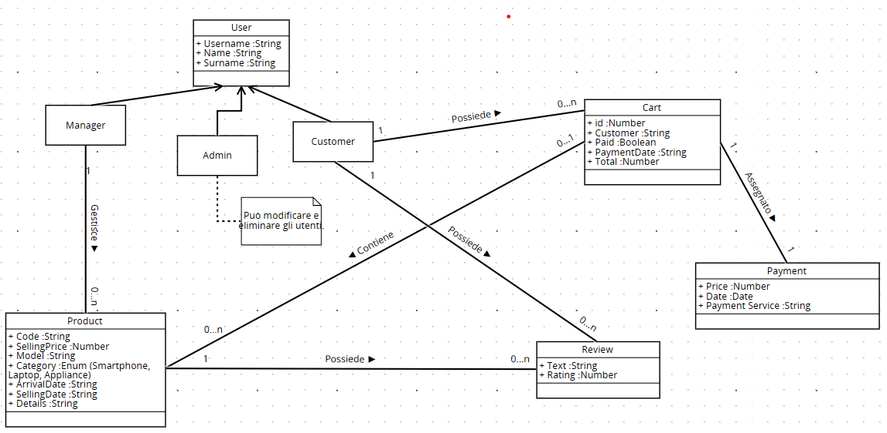

# Requirements Document - future EZElectronics

Date:

Version: V1 - description of EZElectronics in FUTURE form (as proposed by the team)

| Version number | Change |
| :------------: | :----: |
|                |        |

# Contents

- [Requirements Document - future EZElectronics](#requirements-document---future-ezelectronics)
- [Contents](#contents)
- [Informal description](#informal-description)
- [Stakeholders](#stakeholders)
- [Context Diagram and interfaces](#context-diagram-and-interfaces)
  - [Context Diagram](#context-diagram)
  - [Interfaces](#interfaces)
- [Stories and personas](#stories-and-personas)
- [Functional and non functional requirements](#functional-and-non-functional-requirements)
  - [Functional Requirements](#functional-requirements)
  - [Non Functional Requirements](#non-functional-requirements)
- [Use case diagram and use cases](#use-case-diagram-and-use-cases)
  - [Use case diagram](#use-case-diagram)
    - [Use case 1, UC1](#use-case-1-uc1)
        - [Scenario 1.1](#scenario-11)
        - [Scenario 1.2](#scenario-12)
        - [Scenario 1.3](#scenario-13)
        - [Scenario 1.4](#scenario-14)
    - [Use case 2, UC2: Modifica prodotto](#use-case-2-uc2-modifica-prodotto)
        - [Scenario 2.1](#scenario-21)
        - [Scenario 2.2](#scenario-22)
        - [Scenario 2.3](#scenario-23)
        - [Scenario 2.4](#scenario-24)
        - [Scenario 2.5](#scenario-25)
        - [Scenario 2.6](#scenario-26)
    - [Use case 3, UC3: Visualizzazione prodotti](#use-case-3-uc3-visualizzazione-prodotti)
        - [Scenario 3.1](#scenario-31)
        - [Scenario 3.2](#scenario-32)
    - [Use case 4, UC4: Creazione nuovo utente](#use-case-4-uc4-creazione-nuovo-utente)
        - [Scenario 4.1](#scenario-41)
        - [Scenario 4.2](#scenario-42)
    - [Use case 5, UC5: Visualizzazione utente](#use-case-5-uc5-visualizzazione-utente)
        - [Scenario 5.1](#scenario-51)
        - [Scenario 5.2](#scenario-52)
        - [Scenario 5.3](#scenario-53)
        - [Scenario 5.4](#scenario-54)
    - [Use case 6, UC6: Modifica utente](#use-case-6-uc6-modifica-utente)
        - [Scenario 6.1](#scenario-61)
        - [Scenario 6.2](#scenario-62)
    - [Use case 7, UC7: Login](#use-case-7-uc7-login)
        - [Scenario 7.1](#scenario-71)
    - [Use case 8, UC8: Logout](#use-case-8-uc8-logout)
        - [Scenario 8.1](#scenario-81)
    - [Use case 9, UC9: Visualizzazione carrello](#use-case-9-uc9-visualizzazione-carrello)
        - [Scenario 9.1](#scenario-91)
        - [Scenario 9.2](#scenario-92)
        - [Scenario 9.3](#scenario-93)
    - [Use case 10, UC10: Modifica carrello](#use-case-10-uc10-modifica-carrello)
        - [Scenario 10.1](#scenario-101)
        - [Scenario 10.2](#scenario-102)
        - [Scenario 10.3](#scenario-103)
        - [Scenario 10.4](#scenario-104)
        - [Scenario 10.5](#scenario-105)
        - [Scenario 10.6](#scenario-106)
        - [Scenario 10.7](#scenario-107)
    - [Use case 11, UC3: Gestione recensione](#use-case-11-uc3-gestione-recensione)
        - [Scenario 11.1](#scenario-111)
        - [Scenario 11.2](#scenario-112)
        - [Scenario 11.3](#scenario-113)
- [Glossary](#glossary)
- [System Design](#system-design)
- [Deployment Diagram](#deployment-diagram)

# Informal description

EZElectronics (read EaSy Electronics) is a software application designed to help managers of electronics stores to manage their products and offer them to customers through a dedicated website. Managers can assess the available products, record new ones, and confirm purchases. Customers can see available products, add them to a cart and see the history of their past purchases.

# Stakeholders

|   Stakeholder name    | Description |
|   :--------------:    | :---------: |
|        Cliente         | Cliente del sito web che visualizza i prodotti e può inserirli nel carrello           |
|        Manager        | Figura che gestisce l'inserimento, la modifica e la rimozione dei prodotti sul sito            |
|        Admin           | Sviluppatore che gestisce la creazione e accesso dell'utente           |
|  Metodo di pagamento  | Servizio che permette il pagamento dell'ordine online attraverso una piattaforma esterna        |

# Context Diagram and interfaces

## Context Diagram

## Interfaces

|   Actor   | Logical Interface | Physical Interface |
| :-------: | :---------------: | :----------------: |
| Cliente | Smartphone / PC | GUI (tbd – mostrare i prodotti, riempire il carrello, visionare vecchi carrelli, modificare carrello, effettuare l’ordine, login / logout) |
| Manager | Smartphone / PC | GUI (tbd – inserire prodotti, modificare prodotti, login / logout) |
| Admin | PC | GUI (tbd – creazione / rimozione account) |
| Metodo di pagamento | Internet | http://satispay.com/... |

# Stories and personas

* **Persona 1:** donna, 25 anni, nubile, studentessa
  * **Storia:** ha bisogno di un nuovo tablet con cui studiare, il suo tablet attuale non funziona più. Deve trovare un nuovo tablet che abbia un *il costo più contenuto possibile*, anche con funzionalità limitate.
* **Persona 2:** uomo, 50 anni, sposato con figli, poliziotto
  * **Storia:** sta cercando un dispositivo gps per rilevare la posizione del proprio cane. Non ha problemi di budget, ma ha bisogno del *dispositivo con le migliori prestazioni*.
* **Persona 3:** donna, 70 anni, vedova, pensionata
  * **Storia:** è alla ricerca di una tv da usare durante il suo tempo libero. Le serve cercare su una *piattaforma facile da usare* per completare il suo acquisto. 
* **Persona 4:** uomo, 35 anni, sposato, con figli, docente
  * **Storia:** ogni anno fa degli acquisti per la propria classe. Ha necessità di fare ordini molto spesso, quindi cerca una *piattaforma con un'interfaccia intuitiva* che gli faccia perdere meno tempo possibile e con cui poter fare degli ordini *periodici*.
* **Persona 5:** donna, 40 anni, sposata, con figli, medico
  *  **Storia:** sta cercando un regalo da fare a sua figlia e vorrebbe *conoscere le opinioni di altri utenti* riguardo diversi prodotti.

# Functional and non functional requirements

## Functional Requirements

|  ID   | Description |
| :---: | :---------: |
|  **FR1**  | **Gestione prodotti** |
|  FR1.1  | Creazione prodotto |
|  FR1.2  | Inserimento set di prodotto |
|  FR1.3  | Modifica prodotto (contrassegna venduti, cancellazione di tutti i prodotti, cancellazione prodotto) |
|  FR1.4  | Visualizzazione prodotto (elenco prodotti, info su un prodotto, elenco prodotti di una categoria, elenco prodotti di un modello) |
|  **FR2**  | **Autenticazione e autorizzazione**            |
| FR2.1 | Creazione nuovo utente |
| FR2.2 | Visualizzazione utente (visualizzazione singolo utente, info utente loggato) |
| FR2.3 | Login / logout utente |
|  **FR3**  | **Gestione carrello** |
| FR3.1 | Visualizzazione carrello (carrello attuale del cliente, fornire la cronologia dei carrelli pagati) |
| FR3.2 | Modifica carrello (aggiunta di un prodotto, rimozione di un prodotto, svuotamento carrello) |
| FR3.3 | Esecuzione del pagamento del carrello |
| FR3.4 | Reorder carrello precedente |
|  **FR4**  | **Gestione applicazione**    |
| FR4.1 | Visualizzazione utente (elenco utenti, elenco utenti con un ruolo) |
| FR4.2 | Gestione account |
|  **FR5**  | **Gestione pagamento** |
| FR5.1 | Pagamento carrello corrente |
|  **FR6**  | **Gestione recensioni** |
| FR6.1 | Visualizzazione recensione per prodotto |
| FR6.2 | Inserimento recensione |
| FR6.2 | Rimozione recensione |

## Non Functional Requirements

|   ID    | Type (efficiency, reliability, ..) | Description | Refers to |
| :-----: | :--------------------------------: | :---------: | :-------: |
|  NFR1   | Usabilità | Gli utenti non devono avere bisogno di training per l'utilizzo del sito web | FR2, FR3|
|  NFR2   | Usabilità | Il sito deve essere facilmente accessibile e comprensibile | FR1, FR2, FR3|
|  NFR3   | Efficienza | Tutte le funzionalità del sito web devono completarsi in un tempo < 0.1 sec (escludendo la rete) | FR1, FR2, FR3|
|  NFR4   | Affidabilità | Ogni utente non deve segnalare più di un bug all’anno | FR2, FR3|
|  NFR5   | Affidabilità | Backup regolare dei dati per evitare malfunzionamenti e perdita / dispersione di dati | FR3|
|  NFR6   | Portabilità | Disponibilità del website su: Google Chrome, Safari, Mozilla Firefox per Windows 10 e 11 e macOS 14 | FR1, FR2, FR3|

# Use case diagram and use cases

## Use case diagram

### Use case 1, UC1: Creazione prodotto

| Actors involved | Manager |
| :-------------- | :------ |
| Precondition    | Manager loggato |
| Post condition  | Database dei prodotti aggiornato |
| Nominal scenario | 1.1, 1.2 |
| Variants | - |
| Exceptions | 1.3, 1.4 |

##### Scenario 1.1

| Scenario 1.1 | Creazione prodotto |
| :----------- | :----------------- |
| Precondition | Manager loggato |
| Post condition | Database dei prodotti aggiornato |
| Step# | Descrizione |
| 1 | Manager: chiede di inserire un prodotto |
| 2 | Sistema: chiede di inserire codice, prezzo di vendita, modello, categoria, eventuali dettagli e la data di arrivo |
| 3 | Manager: inserisce codice, prezzo di vendita, modello, categoria, eventuali dettagli e la data di arrivo |
| 4 | Sistema: crea un nuovo prodotto e lo memorizza nel database |

##### Scenario 1.2

| Scenario 1.2 | Inserimento set di prodotti |
| :----------- | :------------------------ |
| Precondition | Manager loggato |
| Post condition | Database dei prodotti aggiornato |
| Step# | Descrizione |
| 1 | Manager: chiede di inserire un insieme di prodotti |
| 2 | Sistema: chiede di inserire modello, categoria, dettagli eventuali, quantità, data di arrivo e prezzo di vendita |
| 3 | Manager: inserisce modello, categoria, dettagli eventuali, quantità, data di arrivo e prezzo di vendita |
| 4 | Sistema: aggiorna il database |

##### Scenario 1.3

| Scenario 1.3 | Prodotto già presente nel database |
| :----------- | :--------------------------------- |
| Precondition | Manager loggato |
| Post condition | Inserimento del prodotto fallito |
| Step# | Descrizione |
| 1 | Manager: chiede di inserire un prodotto |
| 2 | Sistema: chiede di inserire modello, categoria, dettagli eventuali, quantità, data di arrivo e prezzo di vendita |
| 3 | Manager: inserisce un codice di un prodotto già presente nel database |
| 4 | Sistema: ritorna errore 409 |

##### Scenario 1.4

| Scenario 1.4 | Data di arrivo dopo il giorno attuale |
| :----------- | :------------------------------------ |
| Precondition | Manager loggato |
| Post condition | Inserimento del prodotto fallito |
| Step# | Descrizione |
| 1 | Manager: chiede di inserire un prodotto o un set di prodotti |
| 2 | Sistema: chiede di inserire i campi |
| 3 | Manager: inserisce una data di arrivo per quel prodotto successiva a quella attuale |
| 4 | Sistema: ritorna errore |

### Use case 2, UC2: Modifica prodotto 

| Actors involved | Manager |
| :-------------- | :------ |
| Precondition    | Manager loggato |
| Post condition  | Database dei prodotti aggiornato |
| Nominal scenario | 2.1, 2.5|
| Variants | - |
| Exceptions | 2.2, 2.3, 2.4, 2.6|

##### Scenario 2.1

| Scenario 2.1 | Segnare un prodotto come venduto |
| :----------- | :------------------------------- |
| Precondition | Manager loggato |
| Post condition | Prodotto venduto |
| Step# | Descrizione |
| 1 | Manager: chiede di marcare un prodotto come venduto |
| 2 | Sistema: chiede di inserire il codice del prodotto e la data di vendita opzionalmente |
| 3 | Manager: inserisce il codice del prodotto da segnare come venduto e una eventuale data di vendita |
| 4 | Sistema: marca il prodotto come venduto |

##### Scenario 2.2

| Scenario 2.2 | Si cerca un prodotto che non è però presente |
| :----------- | :------------------------------------------ |
| Precondition | Manager loggato |
| Post condition | Operazione fallita |
| Step# | Descrizione |
| 1 | Manager: chiede di marcare un prodotto come venduto |
| 2 | Sistema: chiede di inserire il codice del prodotto e la data di vendita opzionalmente |
| 3 | Manager: inserisce il codice di un prodotto non presente nel database |
| 4 | Sistema: ritorna un 404 error |

##### Scenario 2.3

| Scenario 2.3 | Data di vendita inserita non valida |
| :----------- | :---------------------------------- |
| Precondition | Manager loggato |
| Post condition | Operazione fallita |
| Step# | Descrizione |
| 1 | Manager: chiede di marcare un prodotto come venduto |
| 2 | Sistema: chiede di inserire il codice del prodotto e la data di vendita opzionalmente |
| 3 | Manager: inserisce una data di vendita successiva a quella attuale o precedente a quella di arrivo |
| 4 | Sistema: ritorna un error |

##### Scenario 2.4

| Scenario 2.4 | Eliminazione di un prodotto |
| :----------- | :--------------------------------- |
| Precondition | Manager loggato |
| Post condition | Eliminazione del prodotto dal database |
| Step# | Descrizione |
| 1 | Manager: chiede di eliminare un prodotto |
| 2 | Sistema: chiede di inserire il codice del prodotto |
| 3 | Manager: inserisce il codice del prodotto  |
| 4 | Sistema: toglie il prodotto dal database |

##### Scenario 2.5

| Scenario 2.5 | Eliminazione di un prodotto già assente dal database |
| :----------- | :--------------------------------- |
| Precondition | Manager loggato |
| Post condition | Eliminazione del prodotto dal database |
| Step# | Descrizione |
| 1 | Manager: chiede di eliminare un prodotto |
| 2 | Sistema: chiede di inserire il codice del prodotto |
| 3 | Manager: inserisce il codice di un prodotto assente nel database  |
| 4 | Sistema: ritorna 404 error |

### Use case 3, UC3: Visualizzazione prodotti

| Actors involved | Utente |
| :-------------- | :------ |
| Precondition    | Utente loggato |
| Post condition  | visualizzazione dei prodotti nel database |
| Nominal scenario | 3.1, 3.2 |
| Variants | - |
| Exceptions ||

##### Scenario 3.1

| Scenario 3.1 | Visualizzazione di tutti i prodotti |
| :----------- | :---------------------------------- |
| Precondition | Utente loggato |
| Post condition | Visualizzazione di tutti i prodotti nel database |
| Step# | Descrizione |
| 1 | Utente: accede al catalogo |
| 2 | Sistema: chiede di inserire il codice del prodotto e la data di vendita opzionalmente |
| 3 | Manager: inserisce un codice di prodotto già segnato come venduto |
| 4 | Sistema: ritorna un error |

##### Scenario 3.2

| Scenario 3.2 | Visualizzazione dei prodotti di una categoria o modello |
| :----------- | :---------------------------------- |
| Precondition | Utente loggato |
| Post condition | Visualizzazione di tutti i prodotti nel database di una certa gategoria o modello |
| Step# | Descrizione |
| 1 | Utente: accede al catalogo |
| 2 | Sistema: chiede di inserire il modello o la categoria dei prodotti |
| 3 | Manager: inserisce il modello o la categoria dei prodotti da vedere|
| 4 | Sistema: ritorna l'elenco dei prodotti di quella categoria o modello |

### Use case 4, UC4: Creazione nuovo utente

| Actors Involved  |  Utente     |
| :--------------: | :------------------------------------------------------------------: |
|   Precondition   | Utente non registrato |
|  Post condition  |  Utente registrato  |
| Nominal Scenario | Scenario 4.1   |
|    Varianti     |                      No             |
|    Eccezioni    |  Scenario 4.2 |

##### Scenario 4.1

|  Scenario 4.1  |  Creazione account  |
| :------------: | :------------------------------------------------------------------------: |
|  Precondition  | Utente non registrato |
| Post condition |  Utente registrato  |
|     Step#      |               Descrizione    |
|       1        |   Utente: fornisce dati per la registrazione (username, name, surname, password, ruolo)  |
|       2        |   Sistema: elabora le informazioni e permette la registrazione dell'account  |

##### Scenario 4.2

|  Scenario 4.2  |  Utente già registrato  |
| :------------: | :------------------------------------------------------------------------: |
|  Precondition  | Utente registrato |
| Post condition |  Utente registrato  |
|     Step#      |               Descrizione    |
|       1        |   Utente: fornisce dati per la registrazione (username, name, surname, password, ruolo)   |
|       2        |   Sistema: elabora le richiesta e npon permette la registrazione, l'utente è già registrato  |

### Use case 5, UC5: Visualizzazione utente

| Actors Involved  |  Utente     |
| :--------------: | :------------------------------------------------------------------: |
|   Precondition   | Utente loggato, ricerca informazioni su altri utenti |
|  Post condition  |  Visualizzazione informazioni  |
| Nominal Scenario | Scenario 5.1, 5.2, 5.3   |
|    Varianti     |                      No             |
|    Eccezioni    |  Scenario 5.4 |

##### Scenario 5.1

|  Scenario 5.1  |  Visualizzazione lista di tutti gli utenti  |
| :------------: | :------------------------------------------------------------------------: |
|  Precondition  | Utente loggato, ricerca informazioni su altri utenti |
| Post condition |  Visualizzazione informazioni di tutti gli utenti  |
|     Step#      |               Descrizione    |
|       1        |   Utente: richiede informazioni di tutti gli utenti  |
|       2        |   Sistema: elabora la richiesta e fornisce una lista con tutte le informazioni di tutti gli utenti (username, name, surname, password, ruolo)  |

##### Scenario 5.2

|  Scenario 5.2  |  Visualizzazione informazioni degli utenti per ruolo  |
| :------------: | :------------------------------------------------------------------------: |
|  Precondition  | Utente loggato, ricerca informazioni su altri utenti |
| Post condition |  Visualizzazione informazioni degli utenti per ruolo  |
|     Step#      |               Descrizione    |
|       1        |   Utente: richiede informazioni di tutti i clienti oppure di tutti i managers  |
|       2        |   Sistema: elabora la richiesta e fornisce una lista con tutte le informazioni di tutti i clienti oppure di tutti i managers (username, name, surname, password, ruolo) |

##### Scenario 5.3

|  Scenario 5.3  |  Visualizzazione utente con specifico username  |
| :------------: | :------------------------------------------------------------------------: |
|  Precondition  | Utente loggato, ricerca informazioni su altri utenti |
| Post condition | Visualizzazione informazioni dell'utente richiesto  |
|     Step#      |               Descrizione    |
|       1        |   Utente: richiede informazioni di un utente inserendo il suo username  |
|       2        |   Sistema: elabora le informazioni e fornisce le informazioni dell'utente richiesto (username, name, surname, password, ruolo)  |

##### Scenario 5.4

|  Scenario 5.4  |  Utente non presente nel database  |
| :------------: | :------------------------------------------------------------------------: |
|  Precondition  | Utente loggato, ricerca informazioni su altri utenti |
| Post condition |  Nessuna visualizzazione  |
|     Step#      |               Descrizione    |
|       1        |   Utente: richiede informazioni di un utente inserendo il suo username   |
|       2        |   Sistema: elabora le informazioni e non permette nessuna visualizzazione, l'utente non esiste con quel username  |

### Use case 6, UC6: Login

| Actors Involved  |  Utente  |
| :--------------: | :------------------------------------------------------------------: |
|   Precondition   | Utente registrato e non loggato |
|  Post condition  |  Utente loggato  |
| Nominal Scenario |   Scenario 6.1  |
|     Variants     |   No    |
|    Exceptions    |   No   |

##### Scenario 6.1

|  Scenario 6.1  |  Login  |
| :------------: | :------------------------------------------------------------------------: |
|  Precondition  | Utente registrato e non loggato |
| Post condition |  Utente loggato  |
|     Step#      |               Descrizione    |
|       1        |   Sistema: richiede email e password   |
|       2        |   Utente: fornisce email e password  |
|      3      |   Sistema: elabora le informazioni e autorizza l’utente a fare login |

### Use case 7, UC7: Logout

| Actors Involved  |  Utente     |
| :--------------: | :------------------------------------------------------------------: |
|   Precondition   | Utente loggato |
|  Post condition  |  Utente non loggato  |
| Nominal Scenario | Scenario 7.1   |
|    Varianti     |                      No             |
|    Eccezioni    |    No   |

##### Scenario 7.1

|  Scenario 7.1  |  Logout  |
| :------------: | :------------------------------------------------------------------------: |
|  Precondition  | Utente loggato |
| Post condition |  Utente non loggato  |
|     Step#      |               Descrizione    |
|       1        |   Utente: richiede logout   |
|       2        |   Sistema: elabora la richiesta e permette il logout  |

### Use case 8, UC8: Visualizzazione carrello

| Actors involved | Cliente |
| :-------------- | :------ |
| Precondition    | Cliente loggato |
| Post condition  | Visualizzazione dei prodotti di un carrello |
| Nominal scenario | 8.1, 8.2, 8.3 |
| Variants | - |
| Exceptions |  |

##### Scenario 8.1

| Scenario 8.1 | Visualizzazione del carrello attuale |
| :----------- | :----------------- |
| Precondition | Cliente loggato |
| Post condition | Visualizzazione del carrello attuale dell'utente loggato |
| Step# | Descrizione |
| 1 | Cliente: chiede di visualizzare il carrello |
| 2 | Sistema: torna l'elenco dei prodotti presenti nel carrello |

##### Scenario 8.2

| Scenario 8.2 | Visualizzazione della storia dei carrelli già pagati |
| :----------- | :----------------- |
| Precondition | Cliente loggato |
| Post condition | Visualizzazione dei carrelli già pagati dal cliente |
| Step# | Descrizione |
| 1 | Cliente: chiede di visualizzare i carrelli |
| 2 | Sistema: torna l'elenco dei vecchi carrelli già pagati |

##### Scenario 8.3

| Scenario 8.3 | Reorder di un vecchio carrello presente nello storico |
| :----------- | :----------------- |
| Precondition | Cliente loggato |
| Post condition | Nuovo ordine corrispondente ad un precedente carrello |
| Step# | Descrizione |
| 1 | Cliente: chiede di visualizzare i carrelli |
| 2 | Sistema: torna l'elenco dei vecchi carrelli già pagati |
| 3 | Cliente: chiede il reoder di un carrello |
| 4 | Sistema: avvia la transazione |

### Use case 9, UC9: Modifica carrello

| Actors involved | Cliente |
| :-------------- | :------ |
| Precondition    | Cliente loggato |
| Post condition  | Modifica del carrello |
| Nominal scenario | 9.1, 9.5, 9.7 |
| Variants | - |
| Exceptions | 9.2, 9.3, 9.4, 9.6 |

##### Scenario 9.1

| Scenario 9.1 | Aggiunta di un prodotto |
| :----------- | :----------------- |
| Precondition | Cliente loggato |
| Post condition | Aggiunta di un prodotto al carrello |
| Step# | Descrizione |
| 1 | Cliente: chiede di inserire il prodotto al carrello |
| 2 | Sistema: chiede id del prodotto  |
| 3 | cliente: inserisce id del prodotto  |
| 4 | sistema: aggiunge il prodotto all'elenco dei prodotti del carrello attuale |

##### Scenario 9.2

| Scenario 10.2 | Il prodotto non può essere aggiunto o rimosso  |
| :----------- | :----------------- |
| Precondition | Cliente loggato |
| Post condition | Sistema ritorna errore |
| Step# | Descrizione |
| 1 | Cliente: chiede di inserire o rimuovere il prodotto al carrello |
| 2 | Sistema: chiede id del prodotto  |
| 3 | cliente: inserisce un id relativo ad un prodotto già venduto |
| 4 | sistema: ritorna 409 error |

##### Scenario 9.3

| Scenario 9.3 | Il prodotto non può essere rimosso  |
| :----------- | :----------------- |
| Precondition | Cliente loggato |
| Post condition | Sistema ritorna errore |
| Step# | Descrizione |
| 1 | Cliente: chiede di inserire il prodotto al carrello |
| 2 | Sistema: chiede id del prodotto  |
| 3 | cliente: inserisce un id relativo ad un prodotto non nel carrello |
| 4 | sistema: ritorna 404 error |

##### Scenario 9.4

| Scenario 9.4 | Rimozione prodotto |
| :----------- | :----------------- |
| Precondition | Cliente loggato |
| Post condition | Sistema toglie il prodotto dal carrello |
| Step# | Descrizione |
| 1 | Cliente: chiede di rimuovere il prodotto al carrello |
| 2 | Sistema: chiede id del prodotto  |
| 3 | cliente: inserisce un id valido  |
| 4 | sistema: toglie il prodotto dal carrello |

##### Scenario 9.5

| Scenario 9.5 | Svuota carrello corrente |
| :----------- | :----------------- |
| Precondition | Cliente loggato |
| Post condition | Sistema svuota il carrello |
| Step# | Descrizione |
| 1 | Cliente: chiede di svuotare il carrello|
| 2 | Sistema: svuota il carrello |

### Use case 10, UC10: Gestione applicazione

| Actors involved | Admin |
| :-------------- | :------ |
| Precondition    | Utente loggato come cliente |
| Post condition  | Accesso al servizio di pagamento |
| Nominal scenario | 10.1, 10.2 |
| Variants | - |
| Exceptions ||

##### Scenario 10.1

| Scenario 10.1 | Visualizzazione utente
| :----------- | :---------------------------------- |
| Precondition | Admin loggato |
| Post condition | Visualizzazione dell'account dell'utente |
| Step# | Descrizione |
| 1 | Admin: Richiede la visualizzazione di un account inserendo lo username |
| 2 | Sistema: Mostra l'account con le specifiche |

##### Scenario 10.2

| Scenario 10.2 | Gestione account
| :----------- | :---------------------------------- |
| Precondition | Admin loggato |
| Post condition | Rimozione account individuato |
| Step# | Descrizione |
| 1 | Admin: Richiede la rimozione di un account inserendo lo username |
| 2 | Sistema: Rimuove l'account selezionato |

### Use case 11, UC11: Gestione pagamento

| Actors involved | Utente |
| :-------------- | :------ |
| Precondition    | Utente loggato come cliente |
| Post condition  | Accesso al servizio di pagamento |
| Nominal scenario | 11.1 |
| Variants | - |
| Exceptions ||

##### Scenario 11.1

| Scenario 11.1 | Pagamento del carrello corrente
| :----------- | :---------------------------------- |
| Precondition | Utente loggato come cliente |
| Post condition | Accesso al servizio di pagamento |
| Step# | Descrizione |
| 1 | Utente: visualizza il carrello e procede al pagamento |
| 2 | Sistema: rinvia al sito del servizio di pagamneto |

### Use case 12, UC12: Gestione recensione

| Actors involved | Utente |
| :-------------- | :------ |
| Precondition    | Utente loggato come cliente |
| Post condition  | aggiornamento database recensioni |
| Nominal scenario | 12.1, 12.2, 12.3 |
| Variants | - |
| Exceptions ||

##### Scenario 12.1

| Scenario 12.1 | Visualizzazione di tutte le recensioni di un prodotto
| :----------- | :---------------------------------- |
| Precondition | Utente loggato come cliente |
| Post condition | Visualizzazione di tutti le recensioni nel database |
| Step# | Descrizione |
| 1 | Utente: visualizza il prodotto |
| 2 | Sistema: carica tutte le recensioni memorizzate nel database e relative a quel prodotto |

##### Scenario 12.2

| Scenario 12.2 | Inserisci recensione
| :----------- | :---------------------------------- |
| Precondition | Utente loggato come cliente |
| Post condition | Nuova recensione inserita |
| Step# | Descrizione |
| 1 | Utente: visualizza il prodotto e chiede di inserire una recensione |
| 2 | Sistema: chiede il testo della recensione |
| 3 | Utente: chiede il testo della recensione |
| 4 | Sistema: inserisce la nuova recensione al database |

##### Scenario 12.3

| Scenario 12.3 | Elimina recensione
| :----------- | :---------------------------------- |
| Precondition | Utente loggato come cliente |
| Post condition | Elimina recensione inserita |
| Step# | Descrizione |
| 1 | Utente: Visualizza le recensioni e chiede di eliminare la propria|
| 2 | Sistema: elimina la recensione dal database |

# Glossary

# System Design

# Deployment Diagram

