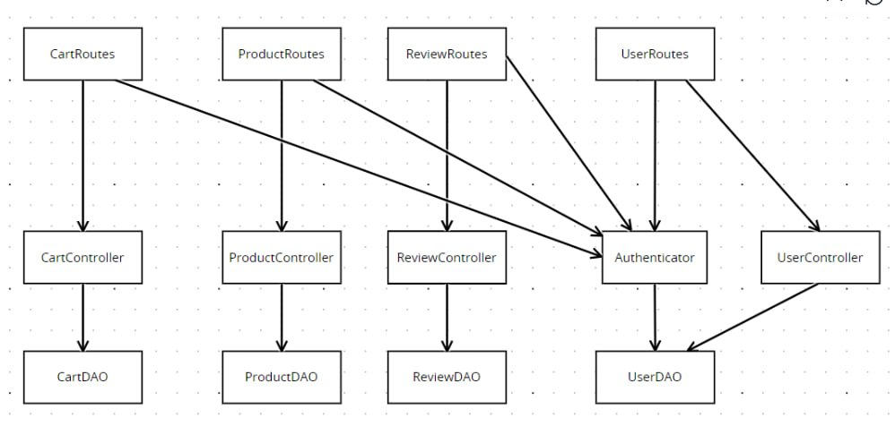
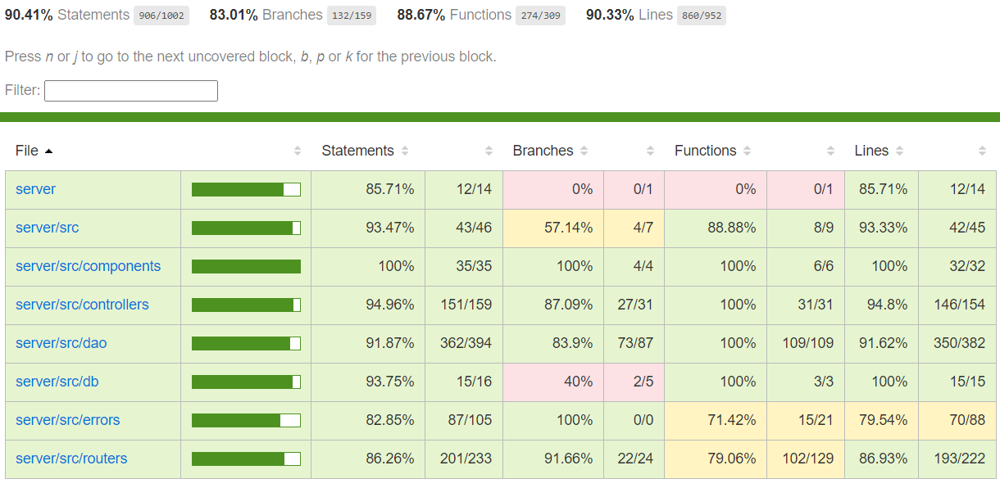

# Test Report

<The goal of this document is to explain how the application was tested, detailing how the test cases were defined and what they cover>

# Contents

- [Test Report](#test-report)
- [Contents](#contents)
- [Dependency graph](#dependency-graph)
- [Unit approach](#unit-approach)
- [Tests](#tests)
    - [Review Controller Unit Tests](#review-controller-unit-tests)
    - [Review DAO Unit Tests](#review-dao-unit-tests)
    - [Review Routes Unit Tests](#review-routes-unit-tests)
    - [Review Integration Tests](#review-integration-tests)
    - [Cart DAO Unit Tests](#cart-dao-unit-tests)
    - [Cart Controller Unit Tests](#cart-controller-unit-tests)
    - [Cart Routes Unit Tests](#cart-routes-unit-tests)
    - [Cart Integration Tests](#cart-integration-tests)
    - [Product DAO Unit Tests](#product-dao-unit-tests)
    - [Product Controller Unit Test](#product-controller-unit-test)
    - [Product Routes Unit Tests](#product-routes-unit-tests)
    - [Product Integration Tests](#product-integration-tests)
    - [User DAO Unit Tests](#user-dao-unit-tests)
    - [User Controller Unit Test](#user-controller-unit-test)
    - [User Routes Unit Tests](#user-routes-unit-tests)
    - [User Integration Tests](#user-integration-tests)
- [Coverage](#coverage)
  - [Coverage of FR](#coverage-of-fr)
    - [Cart](#cart)
  - [Coverage white box](#coverage-white-box)

# Dependency graph

# Unit approach

    <L'approccio unitario adottato è di tipo bottom-up, in modo da risolvere eventuali problemi a livello di singole unità: si inizia sviluppando e integrando i componenti base come controller, Dao, routes, seguiti dai test unitari per ogni componente e per le funzionalità di route. Si termina con i test di integrazione per verificare il corretto funzionamento dell'intero sistema nel suo complesso. 

sequence you adopted, in general terms (top down, bottom up, mixed) and as sequence

    (ex: step1: unit A, step 2: unit A+B, step 3: unit A+B+C, etc)>

    <Some steps may  correspond to unit testing (ex step1 in ex above)>

    <One step will  correspond to API testing, or testing unit route.js>

# Tests

<in the table below list the test cases defined For each test report the object tested, the test level (API, Unit, unit) and the technique used to define the test case (BB/ eq partitioning, BB/ boundary, WB/ statement coverage, etc)> <split the table if needed>

### Review Controller Unit Tests

|                          Test case name                           | Object(s) tested | Test level |     Technique used     |
| :---------------------------------------------------------------: | :--------------: | :--------: | :--------------------: |
|              addReview should call newReview on DAO               | ReviewController |    Unit    | WB/ statement coverage |
|        getProductReviews should call returnReviews on DAO         | ReviewController |    Unit    | WB/ statement coverage |
|           deleteReview should call deleteReview on DAO            | ReviewController |    Unit    | WB/ statement coverage |
| deleteReviewsOfProduct should call deleteAllReviewsProduct on DAO | ReviewController |    Unit    | WB/ statement coverage |
|       deleteAllReviews should call deleteAllReviews on DAO        | ReviewController |    Unit    | WB/ statement coverage |

### Review DAO Unit Tests

|                                        Test case name                                         | Object(s) tested | Test level |     Technique used     |
| :-------------------------------------------------------------------------------------------: | :--------------: | :--------: | :--------------------: |
|                         newReview should add a review to the database                         |    ReviewDAO     |    Unit    | WB/ statement coverage |
|              newReview should reject with an error if the product does not exist              |    ReviewDAO     |    Unit    | WB/ statement coverage |
|      newReview should reject with an error if the user has already reviewed the product       |    ReviewDAO     |    Unit    | WB/ statement coverage |
|        newReview should reject with an error if there is an error checking the product        |    ReviewDAO     |    Unit    | WB/ statement coverage |
|     newReview should reject with an error if there is an error checking existing reviews      |    ReviewDAO     |    Unit    | WB/ statement coverage |
|        newReview should reject with an error if there is an error inserting the review        |    ReviewDAO     |    Unit    | WB/ statement coverage |
|            returnReviews should return all reviews for a product from the database            |    ReviewDAO     |    Unit    | WB/ statement coverage |
|            returnReviews should reject with an error if the product does not exist            |    ReviewDAO     |    Unit    | WB/ statement coverage |
|      returnReviews should reject with an error if there is an error checking the product      |    ReviewDAO     |    Unit    | WB/ statement coverage |
|        returnReviews should reject with an error if there is an error fetching reviews        |    ReviewDAO     |    Unit    | WB/ statement coverage |
|                     deleteReview should delete a review from the database                     |    ReviewDAO     |    Unit    | WB/ statement coverage |
|            deleteReview should reject with an error if the product does not exist             |    ReviewDAO     |    Unit    | WB/ statement coverage |
|       deleteReview should reject with an error if the user has not reviewed the product       |    ReviewDAO     |    Unit    | WB/ statement coverage |
|      deleteReview should reject with an error if there is an error checking the product       |    ReviewDAO     |    Unit    | WB/ statement coverage |
|       deleteReview should reject with an error if there is an error checking the review       |    ReviewDAO     |    Unit    | WB/ statement coverage |
|       deleteReview should reject with an error if there is an error deleting the review       |    ReviewDAO     |    Unit    | WB/ statement coverage |
|       deleteAllReviewsProduct should delete all reviews for a product from the database       |    ReviewDAO     |    Unit    | WB/ statement coverage |
|       deleteAllReviewsProduct should reject with an error if the product does not exist       |    ReviewDAO     |    Unit    | WB/ statement coverage |
| deleteAllReviewsProduct should reject with an error if there is an error checking the product |    ReviewDAO     |    Unit    | WB/ statement coverage |
|   deleteAllReviewsProduct should reject with an error if there is an error deleting reviews   |    ReviewDAO     |    Unit    | WB/ statement coverage |
|                 deleteAllReviews should delete all reviews from the database                  |    ReviewDAO     |    Unit    | WB/ statement coverage |
|      deleteAllReviews should reject with an error if there is an error deleting reviews       |    ReviewDAO     |    Unit    | WB/ statement coverage |

### Review Routes Unit Tests

| Test Case Name                                     | Object(s) tested       | Test Level | Technique Used         |
| -------------------------------------------------- | ---------------------- | ---------- | ---------------------- |
| Review tests                                       | ReviewController       | Unit       | WB/ statement coverage |
| It should return a 200 success code if a review... | addReview              | Unit       | WB/ statement coverage |
| It should return a 422 error code if the score ... | addReview              | Unit       | WB/ statement coverage |
| It should return a 422 error code if the model...  | addReview              | Unit       | WB/ statement coverage |
| It should return a 422 error code if the comme...  | addReview              | Unit       | WB/ statement coverage |
| It should return a 401 error code if the user ...  | addReview              | Unit       | WB/ statement coverage |
| It should return a 401 error code if the user ...  | addReview              | Unit       | WB/ statement coverage |
| It should return a 200 success code if all rev...  | getProductReviews      | Unit       | WB/ statement coverage |
| It should return a 401 error code if the user ...  | getProductReviews      | Unit       | WB/ statement coverage |
| It should return a 200 success code if a revie...  | deleteReview           | Unit       | WB/ statement coverage |
| It should return a 401 error code if the user ...  | deleteReview           | Unit       | WB/ statement coverage |
| It should return a 401 error code if the user ...  | deleteReview           | Unit       | WB/ statement coverage |
| It should return a 401 error code if the user ...  | deleteReview           | Unit       | WB/ statement coverage |
| It should return a 200 success code if all rev...  | deleteReviewsOfProduct | Unit       | WB/ statement coverage |
| It should return a 401 error code if the user ...  | deleteReviewsOfProduct | Unit       | WB/ statement coverage |
| It should return a 401 error code if the user ...  | deleteReviewsOfProduct | Unit       | WB/ statement coverage |
| It should return a 200 success code if all rev...  | deleteAllReviews       | Unit       | WB/ statement coverage |
| It should return a 401 error code if the user ...  | deleteAllReviews       | Unit       | WB/ statement coverage |
| It should return a 401 error code if the user ...  | deleteAllReviews       | Unit       | WB/ statement coverage |

### Review Integration Tests

| Test Case Name                                        | Object(s) tested | Test Level  | Technique Used      |
| ----------------------------------------------------- | ---------------- | ----------- | ------------------- |
| add Review - OK                                       | Review routes    | Integration | BB/ eq partitioning |
| add review - already existing review (409)            | Review routes    | Integration | BB/ boundary        |
| add review - insert an error of score (422)           | Review routes    | Integration | BB/ boundary        |
| get reviews - OK                                      | Review routes    | Integration | BB/ eq partitioning |
| delete review - OK                                    | Review routes    | Integration | Black Box Testing   |
| delete review - review not found (404)                | Review routes    | Integration | BB/ boundary        |
| delete review - unauthorized (401)                    | Review routes    | Integration | BB/ boundary        |
| delete all reviews for a product - OK                 | Review routes    | Integration | BB/ eq partitioning |
| delete all reviews for a product - unauthorized (401) | Review routes    | Integration | BB/ boundary        |
| delete all reviews - ok                               | Review routes    | Integration | BB/ boundary        |

---

### Cart DAO Unit Tests

| Test case name                                                                                   | Object(s) tested | Test level |     Technique used     |
| ------------------------------------------------------------------------------------------------ | :--------------: | :--------: | :--------------------: |
| createCart - It should return true                                                               |     CartDAO      |    Unit    | WB/ statement coverage |
| createCart - It should reject                                                                    |     CartDAO      |    Unit    | WB/ statement coverage |
| getCurrentCart - It should return a cart                                                         |     CartDAO      |    Unit    | WB/ statement coverage |
| getCurrentCart - It should return null                                                           |     CartDAO      |    Unit    | WB/ statement coverage |
| getCurrentCart - It should reject                                                                |     CartDAO      |    Unit    | WB/ statement coverage |
| getPaidCarts - It should return a list of carts                                                  |     CartDAO      |    Unit    | WB/ statement coverage |
| getPaidCarts - It should return an empty list                                                    |     CartDAO      |    Unit    | WB/ statement coverage |
| getPaidCarts - It should reject                                                                  |     CartDAO      |    Unit    | WB/ statement coverage |
| getAllCarts - It should return a list of carts                                                   |     CartDAO      |    Unit    | WB/ statement coverage |
| getAllCarts - It should return an empty list                                                     |     CartDAO      |    Unit    | WB/ statement coverage |
| getAllCarts - It should reject                                                                   |     CartDAO      |    Unit    | WB/ statement coverage |
| addCartProduct - It should only use db.run because username is not passed and return true        |     CartDAO      |    Unit    | WB/ statement coverage |
| addCartProduct - It should use db.get before db.run because username is provided and return true |     CartDAO      |    Unit    | WB/ statement coverage |
| addCartProduct - It should reject                                                                |     CartDAO      |    Unit    | WB/ statement coverage |
| updateCartToPaid - It should return true                                                         |     CartDAO      |    Unit    | WB/ statement coverage |
| updateCartToPaid - It should reject                                                              |     CartDAO      |    Unit    | WB/ statement coverage |
| incrementProductQty - It should return true                                                      |     CartDAO      |    Unit    | WB/ statement coverage |
| incrementProductQty - It should reject                                                           |     CartDAO      |    Unit    | WB/ statement coverage |
| decrementProductQty - It should return true                                                      |     CartDAO      |    Unit    | WB/ statement coverage |
| decrementProductQty - It should reject                                                           |     CartDAO      |    Unit    | WB/ statement coverage |
| deleteAllCartProducts - It should return true                                                    |     CartDAO      |    Unit    | WB/ statement coverage |
| deleteAllCartProducts - It should reject                                                         |     CartDAO      |    Unit    | WB/ statement coverage |
| deleteAllCarts - It should return true                                                           |     CartDAO      |    Unit    | WB/ statement coverage |

### Cart Controller Unit Tests

| Test case name                                                                  | Object(s) tested | Test level |     Technique used     |
| ------------------------------------------------------------------------------- | :--------------: | :--------: | :--------------------: |
| addToCart - It should create a new cart, add the product to it, and return true |  CartController  |    Unit    | WB/ statement coverage |
| addToCart - It should add the product to the existing cart and return true      |  CartController  |    Unit    | WB/ statement coverage |
| addToCart - It should increment the quantity of the product and return true     |  CartController  |    Unit    | WB/ statement coverage |
| addToCart - It should throw ProductNotFoundError                                |  CartController  |    Unit    | WB/ statement coverage |
| addToCart - It should throw EmptyProductStockError                              |  CartController  |    Unit    | WB/ statement coverage |
| getCart - It should return the cart of the user                                 |  CartController  |    Unit    | WB/ statement coverage |
| getCart - It should return the default cart                                     |  CartController  |    Unit    | WB/ statement coverage |
| checkoutCart - It should return true                                            |  CartController  |    Unit    | WB/ statement coverage |
| checkoutCart - It should throw CartNotFoundError                                |  CartController  |    Unit    | WB/ statement coverage |
| checkoutCart - It should throw EmptyCartError                                   |  CartController  |    Unit    | WB/ statement coverage |
| checkoutCart - It should throw EmptyProductStockError                           |  CartController  |    Unit    | WB/ statement coverage |
| checkoutCart - It should throw LowProductStockError                             |  CartController  |    Unit    | WB/ statement coverage |
| checkoutCart - It should throw LowProductStockError                             |  CartController  |    Unit    | WB/ statement coverage |
| getCustomerCarts - It should return the paid carts of the user                  |  CartController  |    Unit    | WB/ statement coverage |
| removeProductFromCart - It should return true                                   |  CartController  |    Unit    | WB/ statement coverage |
| removeProductFromCart - It should throw ProductNotInCartError                   |  CartController  |    Unit    | WB/ statement coverage |
| removeProductFromCart - It should throw ProductNotFoundError                    |  CartController  |    Unit    | WB/ statement coverage |
| removeProductFromCart - It should throw CartNotFoundError                       |  CartController  |    Unit    | WB/ statement coverage |
| clearCart - It should return true                                               |  CartController  |    Unit    | WB/ statement coverage |
| getAllCarts - It should return all carts                                        |  CartController  |    Unit    | WB/ statement coverage |

### Cart Routes Unit Tests

| Test Case Name                                                   | Object(s) tested | Test Level |     Technique Used     |
| ---------------------------------------------------------------- | :--------------: | :--------: | :--------------------: |
| GET / - It should return 200                                     |    CartRouter    |    Unit    | WB/ statement coverage |
| GET / - It should return 401 if not a customer                   |    CartRouter    |    Unit    | WB/ statement coverage |
| POST / - It should return 200                                    |    CartRouter    |    Unit    | WB/ statement coverage |
| POST / - It should return 401 if not a customer                  |    CartRouter    |    Unit    | WB/ statement coverage |
| PATCH / - It should return 200                                   |    CartRouter    |    Unit    | WB/ statement coverage |
| PATCH / - It should return 401 if not a customer                 |    CartRouter    |    Unit    | WB/ statement coverage |
| GET /history - It should return 200                              |    CartRouter    |    Unit    | WB/ statement coverage |
| GET /history - It should return 401 if not a customer            |    CartRouter    |    Unit    | WB/ statement coverage |
| DELETE /products/:model - It should return 200                   |    CartRouter    |    Unit    | WB/ statement coverage |
| DELETE /products/:model - It should return 401 if not a customer |    CartRouter    |    Unit    | WB/ statement coverage |
| DELETE /current - It should return 200                           |    CartRouter    |    Unit    | WB/ statement coverage |
| DELETE /current - It should return 401 if not a customer         |    CartRouter    |    Unit    | WB/ statement coverage |
| DELETE / - It should return 200                                  |    CartRouter    |    Unit    | WB/ statement coverage |
| DELETE / - It should return 401 if an admin or manager           |    CartRouter    |    Unit    | WB/ statement coverage |
| GET /all - It should return 200                                  |    CartRouter    |    Unit    | WB/ statement coverage |
| GET /all - It should return 401 if not an admin or manager       |    CartRouter    |    Unit    | WB/ statement coverage |

### Cart Integration Tests

| Test Case Name                                                                                         |          Object(s) tested           | Test Level  |   Technique Used    |
| ------------------------------------------------------------------------------------------------------ | :---------------------------------: | :---------: | :-----------------: |
| GET / - It should return 200 and an empty cart                                                         | CartRouter, CartController, CartDAO | Integration | BB/ eq partitioning |
| GET / - It should return 200 and a cart                                                                | CartRouter, CartController, CartDAO | Integration | BB/ eq partitioning |
| POST / - It should return 200 and add a product to the cart                                            | CartRouter, CartController, CartDAO | Integration | BB/ eq partitioning |
| POST / - It should return 200 and increment the first product to 2                                     | CartRouter, CartController, CartDAO | Integration | BB/ eq partitioning |
| POST / - It should return 404 because the product does not exist                                       | CartRouter, CartController, CartDAO | Integration |    BB/ boundary     |
| PATCH / - It should return 200 and set the cart to paid                                                | CartRouter, CartController, CartDAO | Integration | BB/ eq partitioning |
| PATCH / - It should return 404 because there is no current cart                                        | CartRouter, CartController, CartDAO | Integration |    BB/ boundary     |
| PATCH / - It should return 400 because the current cart has no products                                | CartRouter, CartController, CartDAO | Integration |    BB/ boundary     |
| PATCH / - It should return 409 because the quantity in stock of the product is lower then the required | CartRouter, CartController, CartDAO | Integration |    BB/ boundary     |
| GET /history - It should return 200 and return the history of the customer                             | CartRouter, CartController, CartDAO | Integration | BB/ eq partitioning |
| DELETE /products/:model - It should return 200 and remove the product from the cart                    | CartRouter, CartController, CartDAO | Integration | BB/ eq partitioning |
| DELETE /products/:model - It should return 404 because product is not in cart                          | CartRouter, CartController, CartDAO | Integration |    BB/ boundary     |
| DELETE /products/:model - It should return 404 because the product does not exist                      | CartRouter, CartController, CartDAO | Integration |    BB/ boundary     |
| DELETE /current - It should return 200 and remove the current cart                                     | CartRouter, CartController, CartDAO | Integration | BB/ eq partitioning |
| GET /all - It should return 200 and return all carts                                                   | CartRouter, CartController, CartDAO | Integration | BB/ eq partitioning |
| GET /all - It should return 401 because is not manager or admin                                        | CartRouter, CartController, CartDAO | Integration |    BB/ boundary     |
| DELETE / - It should return 200 and remove all carts                                                   | CartRouter, CartController, CartDAO | Integration | BB/ eq partitioning |
| DELETE / - It should return 401 because is not manager or admin                                        | CartRouter, CartController, CartDAO | Integration |    BB/ boundary     |

### Product DAO Unit Tests

| Test case name                                                                      | Object(s) tested | Test level |     Technique used     |
| ----------------------------------------------------------------------------------- | :--------------: | :--------: | :--------------------: |
| Create product - It should return undefined                                         |    ProductDAO    |    Unit    | WB/ statement coverage |
| Change quantity - It should return the new quatity                                  |    ProductDAO    |    Unit    | WB/ statement coverage |
| Get Products - It should return the all products                                    |    ProductDAO    |    Unit    | WB/ statement coverage |
| Sell Product - It should return the decrease quantity                               |    ProductDAO    |    Unit    | WB/ statement coverage |
| Available Products - Return the product with quantity greather than 0               |    ProductDAO    |    Unit    | WB/ statement coverage |
| Delete all products - It should return true                                         |    ProductDAO    |    Unit    | WB/ statement coverage |
| Delete one product - It should return true                                          |    ProductDAO    |    Unit    | WB/ statement coverage |
| Insert product already exists - It should return error ProductAlreadyExists         |    ProductDAO    |    Unit    | WB/ statement coverage |
| Sell not existing product - It should return error ProductNotFoundError             |    ProductDAO    |    Unit    | WB/ statement coverage |
| Sell product with no quantity - It should return error EmptyProductStockError       |    ProductDAO    |    Unit    | WB/ statement coverage |
| Sell product with not enough quantity - It should return error LowProductStockError |    ProductDAO    |    Unit    | WB/ statement coverage |

### Product Controller Unit Test

| Test case name                                                                                       | Object(s) tested  | Test level |     Technique used     |
| ---------------------------------------------------------------------------------------------------- | :---------------: | :--------: | :--------------------: |
| Register Product - It should create a new product and return undefined                               | ProductController |    Unit    | WB/ statement coverage |
| Change product quantity - It should change the quantity of a product and return the new quantity     | ProductController |    Unit    | WB/ statement coverage |
| Sell product - It should decrese the quantity of the sold product and return the new quantity        | ProductController |    Unit    | WB/ statement coverage |
| Get products - It should return all the products in the stock                                        | ProductController |    Unit    | WB/ statement coverage |
| Get available product - It should return all the products with quantity grather than 0               | ProductController |    Unit    | WB/ statement coverage |
| Delete all products - It should delete all products from the DB and return true                      | ProductController |    Unit    | WB/ statement coverage |
| Delete single product - It should delete the product that match with the given model and return true | ProductController |    Unit    | WB/ statement coverage |

### Product Routes Unit Tests

| Test Case Name                                                             | Object(s) tested | Test Level |     Technique Used     |
| -------------------------------------------------------------------------- | :--------------: | :--------: | :--------------------: |
| POST /products - It should return 200                                      |  ProductRouter   |    Unit    | WB/ statement coverage |
| POST /products - It should return 401 if user not logged in                |  ProductRouter   |    Unit    | WB/ statement coverage |
| POST /products - It should return 422 for low quantity to sold             |  ProductRouter   |    Unit    | WB/ statement coverage |
| PATCH /products/:model - It should return 200                              |  ProductRouter   |    Unit    | WB/ statement coverage |
| PATCH /products/:mode/sell - It should return 200                          |  ProductRouter   |    Unit    | WB/ statement coverage |
| GET /products - It should return 200                                       |  ProductRouter   |    Unit    | WB/ statement coverage |
| GET /products?grouping=category&category=Smartphone - It should return 200 |  ProductRouter   |    Unit    | WB/ statement coverage |
| GET /products/available - It should return 200                             |  ProductRouter   |    Unit    | WB/ statement coverage |
| DELETE /products - It should return 200                                    |  ProductRouter   |    Unit    | WB/ statement coverage |
| DELETE /products/:model - It should return 200                             |  ProductRouter   |    Unit    | WB/ statement coverage |

### Product Integration Tests

| Test Case Name                                                                                    |               Object(s) tested               | Test Level  |   Technique Used    |
| ------------------------------------------------------------------------------------------------- | :------------------------------------------: | :---------: | :-----------------: |
| GET /products - It should return 200 and undefined                                                | ProductRouter, ProductController, ProductDAO | Integration | BB/ eq partitioning |
| PATCH /products/:model - It should return 200 and new quantity of the product                     | ProductRouter, ProductController, ProductDAO | Integration | BB/ eq partitioning |
| PATCH /products/:model/sell - It should return 200 and new sold quantity of the product           | ProductRouter, ProductController, ProductDAO | Integration | BB/ eq partitioning |
| GET /products - It should return 200 and all the products                                         | ProductRouter, ProductController, ProductDAO | Integration | BB/ eq partitioning |
| GET /products/available - It should return 200 and all the products with quantity greather than 0 | ProductRouter, ProductController, ProductDAO | Integration | BB/ eq partitioning |
| DELETE /products - It should return 200 and true if all the products are delete                   | ProductRouter, ProductController, ProductDAO | Integration | BB/ eq partitioning |
| DELETE /products/:model - It should return 200 and true if the product are delete                 | ProductRouter, ProductController, ProductDAO | Integration | BB/ eq partitioning |

### User DAO Unit Tests
|                                Test case name                                | Object(s) tested | Test level | Technique used         |
| :-------------------------------------------------------------------------: | :--------------: | :--------: | :--------------------: |
| createUser should resolve true when user is created                         |    UserDAO       |    Unit    | WB/ statement coverage |
| createUser should reject with UserAlreadyExistsError when username exists   |    UserDAO       |    Unit    | WB/ statement coverage |
| createUser should reject with error when database operation fails           |    UserDAO       |    Unit    | WB/ statement coverage |
| getIsUserAuthenticated should resolve true for correct credentials          |    UserDAO       |    Unit    | WB/ statement coverage |
| getIsUserAuthenticated should resolve false when user is not found          |    UserDAO       |    Unit    | WB/ statement coverage |
| getIsUserAuthenticated should resolve false when password does not match    |    UserDAO       |    Unit    | WB/ statement coverage |
| getIsUserAuthenticated should reject with error when database operation fails |    UserDAO       |    Unit    | WB/ statement coverage |
| getUsers should resolve with user information when users exist               |    UserDAO       |    Unit    | WB/ statement coverage |
| getUsers should reject with error when database operation fails             |    UserDAO       |    Unit    | WB/ statement coverage |
| getUsersByRole should resolve with users of specified role                  |    UserDAO       |    Unit    | WB/ statement coverage |
| getUsersByRole should reject with error when database operation fails       |    UserDAO       |    Unit    | WB/ statement coverage |
| getUserByUsername should resolve with user information when user exists     |    UserDAO       |    Unit    | WB/ statement coverage |
| getUserByUsername should reject with UserNotFoundError when user does not exist |    UserDAO       |    Unit    | WB/ statement coverage |
| getUserByUsername should reject with error when database operation fails    |    UserDAO       |    Unit    | WB/ statement coverage |
| deleteUser should resolve with true when user is deleted by admin           |    UserDAO       |    Unit    | WB/ statement coverage |
| deleteUser should reject with UserNotFoundError when user does not exist    |    UserDAO       |    Unit    | WB/ statement coverage |
| deleteUser should reject with error when database operation fails          |    UserDAO       |    Unit    | WB/ statement coverage |
| deleteAll should resolve with true when all non-Admin users are deleted     |    UserDAO       |    Unit    | WB/ statement coverage |
| deleteAll should reject with error when database operation fails            |    UserDAO       |    Unit    | WB/ statement coverage |
| updateUserInfo should resolve with the updated user when user information is updated |    UserDAO       |    Unit    | WB/ statement coverage |
| updateUserInfo should reject with UserNotFoundError when user does not exist |    UserDAO       |    Unit    | WB/ statement coverage |
| updateUserInfo should reject with error when database operation fails during selection |    UserDAO       |    Unit    | WB/ statement coverage |
| updateUserInfo should reject with error when database operation fails during update |    UserDAO       |    Unit    | WB/ statement coverage |

### User Controller Unit Test

| Test Case                                           | Object Tested                   | Test Level | Technique Used                    |
|-----------------------------------------------------|---------------------------------|------------|-----------------------------------|
| Create a new user                                   | UserController       | Unit       | BB/ equivalence partitioning      |
| Return all users                                    | UserController         | Unit       | BB/ equivalence partitioning      |
| Return users by role                                | UserController   | Unit       | BB/ equivalence partitioning      |
| Return a specific user                              | UserController| Unit       | BB/ equivalence partitioning      |
| Unauthorized user error for getUserByUsername       | UserController| Unit       | BB/ boundary                      |
| Unauthorized edit error for deleteUser              | UserController       | Unit       | BB/ boundary                      |
| User not found error for deleteUser                 | UserController       | Unit       | BB/ boundary                      |
| Delete a user if authorized                         | UserController       | Unit       | BB/ equivalence partitioning      |
| Admin user deletion error for deleteUser            | UserController       | Unit       | BB/ boundary                      |
| Delete all non-admin users                          | UserController        | Unit       | BB/ equivalence partitioning      |
| Update user information                             | UserController   | Unit       | WB/ statement coverage            |
| Invalid birthdate error for updateUserInfo          | UserController   | Unit       | BB/ boundary                      |
| Unauthorized edit error for updateUserInfo          | UserController   | Unit       | BB/ boundary                      |

### User Routes Unit Tests

| Test Case Name                                                               | Object(s) tested | Test Level | Technique Used         |
|------------------------------------------------------------------------------|------------------|------------|------------------------|
| POST /users - It should create a user                                        | UserController   | Unit       | WB/ statement coverage |
| POST /users - It should return 422 if the username is missing                | UserController   | Unit       | WB/ statement coverage |
| POST /users - It should return 422 if the name is missing                    | UserController   | Unit       | WB/ statement coverage |
| POST /users - It should return 422 if the surname is missing                 | UserController   | Unit       | WB/ statement coverage |
| POST /users - It should return 422 if the password is missing                | UserController   | Unit       | WB/ statement coverage |
| POST /users - It should return 422 if the role is missing                    | UserController   | Unit       | WB/ statement coverage |
| GET /users - It should return all users                                      | UserController   | Unit       | WB/ statement coverage |
| GET /users - It should return 401 if the user is not authenticated           | UserController   | Unit       | WB/ statement coverage |
| GET /users - It should return 401 if the user is not an admin                | UserController   | Unit       | WB/ statement coverage |
| GET /users/roles - It should return all users with a specific role           | UserController   | Unit       | WB/ statement coverage |
| GET /users/roles - It should return 401 if the user is not authenticated      | UserController   | Unit       | WB/ statement coverage |
| GET /users/roles - It should return 401 if the user is not an admin           | UserController   | Unit       | WB/ statement coverage |
| GET /users/:username - It should return a user                               | UserController   | Unit       | WB/ statement coverage |
| GET /users/:username - It should return 401 if the user is not authenticated | UserController   | Unit       | WB/ statement coverage |
| DELETE /users/:username - It should delete a user                            | UserController   | Unit       | WB/ statement coverage |
| DELETE /users/:username - It should return 401 if the user is not authenticated| UserController  | Unit       | WB/ statement coverage |
| DELETE /users - It should delete all users                                   | UserController   | Unit       | WB/ statement coverage |
| DELETE /users - It should return 401 if the user is not authenticated        | UserController   | Unit       | WB/ statement coverage |
| DELETE /users - It should return 401 if the user is not an admin             | UserController   | Unit       | WB/ statement coverage |
| PATCH /users/:username - It should update a user                             | UserController   | Unit       | WB/ statement coverage |
| PATCH /users/:username - It should return 401 if the user is not authenticated| UserController  | Unit       | WB/ statement coverage |
| PATCH /users/:username - It should return 422 if the name is missing         | UserController   | Unit       | WB/ statement coverage |
| PATCH /users/:username - It should return 422 if the surname is missing      | UserController   | Unit       | WB/ statement coverage |
| PATCH /users/:username - It should return 422 if the address is missing      | UserController   | Unit       | WB/ statement coverage |

### User Integration Tests

| Test Case Name                                                                                         |          Object(s) tested           | Test Level  |   Technique Used    |
| ------------------------------------------------------------------------------------------------------ | :---------------------------------: | :---------: | :-----------------: |
| GET /users - It should return 200 and a list of users if an admin is logged in.                                                         | UserRouter, UserController, UserDAO | Integration | BB/ eq partitioning |
| GET /users - It should return 401 and an error message if a non-admin is logged in.                                                         | UserRouter, UserController, UserDAO | Integration | BB/ eq partitioning |
| GET /users/roles/:role - It should return 200 and a list of users of a specific role if an admin is logged in.                                                         | UserRouter, UserController, UserDAO | Integration | BB/ eq partitioning |
| GET /users/roles/:role - It should return 401 and an error message if a non-admin is logged in.                                                         | UserRouter, UserController, UserDAO | Integration | BB/ eq partitioning |
| GET /users/:username - It should return 200 if a user retrieves their own information.                                                         | UserRouter, UserController, UserDAO | Integration | BB/ eq partitioning |
| GET /users/:username - It should return 401 and an error message if a user tries to access another user's information.                                                         | UserRouter, UserController, UserDAO | Integration | BB/ eq partitioning |
| DELETE /users/:username - It should return 200 if an admin deletes a user.                                                         | UserRouter, UserController, UserDAO | Integration | BB/ eq partitioning |
| DELETE /users/:username - It should return 404 and an error message if an admin tries to delete a non-existent user.                                                         | UserRouter, UserController, UserDAO | Integration | BB/ eq partitioning |
| DELETE /users/:username - It should return 401 and an error message if a non-admin tries to delete a user.                                                         | UserRouter, UserController, UserDAO | Integration | BB/ eq partitioning |
| DELETE /users/:username - It should return 401 and an error message if an admin tries to delete another admin.                                                         | UserRouter, UserController, UserDAO | Integration | BB/ eq partitioning |
| DELETE /users - It should return 200 if an admin deletes all users.                                                         | UserRouter, UserController, UserDAO | Integration | BB/ eq partitioning |
| PATCH /users/:username - It should return 401 and an error message if an unauthenticated user tries to update a user's information.                                                         | UserRouter, UserController, UserDAO | Integration | BB/ eq partitioning |

# Coverage

## Coverage of FR

<Report in the following table the coverage of functional requirements and scenarios(from official requirements) >

| Functional Requirement or scenario | Test(s) |
| :--------------------------------: | :-----: |
|                **Manage users**                |         
| FR2.1  -  Show the list of all users                             | getUsers should return all users from the database getUsers should reject with an error if there is a database operation failure         |
| FR2.2 - Show the list of all users with a specific role        | getUsersByRole should return users filtered by a specific role from the database getUsersByRole should reject with an error on failure   |
| FR2.3 - Show the information of a single user                  | getUserByUsername should return a specific user by username from the database getUserByUsername should reject with UserNotFoundError when user does not exist    getUserByUsername should reject with an error if there is a database operation failure |
| FR2.4 - Update the information of a single user                | updateUserInfo should update user information in the database updateUserInfo should reject with UserNotFoundError if user doesn't exist   getUserByUsername should reject with error when database operation fails during selection   getUserByUsername should reject with error when database operation fails during update|
| FR2.5 -  Delete a single non Admin user                         | deleteUser should delete a user from the database (non-Admin users only)  It should reject with error when database operation fails   deleteUser should reject with UserNotFoundError if user doesn't exist |
| FR2.6 -  Delete all non Admin users                             | deleteAll should delete all non-Admin users from the database deleteAll should reject with an error on database operation failure         |
|                **Manage reviews**                |         
|  FR4.1  -      Add a new review to a product   | newReview - should add a review to the database newReview should reject with an error if the product does not exist newReview should reject with an error if the user has already reviewed the product newReview should reject with an error if there is an error checking the product newReview should reject with an error if there is an error checking existing reviews newReview should reject with an error if there is an error inserting the review|
|  FR4.2  -   Get the list of all reviews assigned to a product | returnReviews should return all reviews for a product from the database returnReviews should reject with an error if the product does not exist returnReviews should reject with an error if there is an error checking the product returnReviews should reject with an error if there is an error fetching reviews |
|  FR4.3  -          Delete a review given to a product    | deleteReview should delete a review from the database deleteReview should reject with an error if the product does not exist deleteReview should reject with an error if the user has not reviewed the product deleteReview should reject with an error if there is an error checking the product deleteReview should reject with an error if there is an error checking the review deleteReview should reject with an error if there is an error deleting the review|
|  FR4.4 -          Delete all reviews of a product    |deleteAllReviewsProduct should delete all reviews for a product from the database deleteAllReviewsProduct should reject with an error if the product does not exist deleteAllReviewsProduct should reject with an error if there is an error checking the product deleteAllReviewsProduct should reject with an error if there is an error deleting reviews |
|  FR4.5 -       Delete all reviews of all products    | deleteAllReviews should delete all reviews from the database deleteAllReviews should reject with an error if there is an error deleting reviews|

### Cart

| Functional Requirement or scenario                                        | Test(s)                                                                                                                                                    |
| ------------------------------------------------------------------------- | ---------------------------------------------------------------------------------------------------------------------------------------------------------- |
| 10.1 - View information of the current cart (not paid yet)                | GET / - It should return 200 getCart - It should return the cart of the user getCurrentCart - It should return a cart                                |
| 10.2 - View the history of already paid carts                             | GET /history - It should return 200 getCustomerCarts - It should return the paid carts of the user getPaidCarts - It should return a list of carts   |
| 10.3 - Add a product to the current cart                                  | POST / - It should return 200 addToCart - It should add the product to the existing cart and return true incrementProductQty - It should return true |
| 10.4 - Try to add a product that does not exist to the current cart       | addToCart - It should throw ProductNotFoundError                                                                                                           |
| 10.5 - Try to add a product that is not available to the current cart     | addToCart - It should throw EmptyProductStockError                                                                                                         |
| 10.6 - Pay for the current cart                                           | PATCH / - It should return 200 checkoutCart - It should return true updateCartToPaid - It should return true                                         |
| 10.7 - Try to pay for an empty cart                                       | checkoutCart - It should throw EmptyCartError                                                                                                              |
| 10.8 - Try to pay for a cart that does not exist                          | checkoutCart - It should throw CartNotFoundError                                                                                                           |
| 10.9 - Remove one product instance product from the current cart          | DELETE /products/:model - It should return 200 removeProductFromCart - It should return true removeProductFromCart - It should return true           |
| 10.10 - Try to remove a product that does not exist from the current cart | removeProductFromCart - It should throw ProductNotFoundError                                                                                               |
| 10.11 - Try to remove a product from a cart that does not exist           | removeProductFromCart - It should throw CartNotFoundError                                                                                                  |
| 10.12 - Try to remove a product that is not in the current cart           | removeProductFromCart - It should throw ProductNotInCartError                                                                                              |
| 11.1 - Delete the current cart                                            | DELETE /current - It should return 200 clearCart - It should return true deleteAllCartProducts - It should return true                               |
| 11.2 - Try to delete the current cart when there is none                  | DELETE /current - It should return 200 clearCart - It should return true deleteAllCartProducts - It should return true                               |
| 15.1 - View all carts                                                     | GET /all - It should return 200 getAllCarts - It should return all carts getAllCarts - It should return a list of carts                              |
| 16.1 - Delete all carts                                                   | DELETE / - It should return 200 deleteAllCarts - It should return true                                                                                  |

## Coverage white box

Report here the screenshot of coverage values obtained with jest-- coverage

