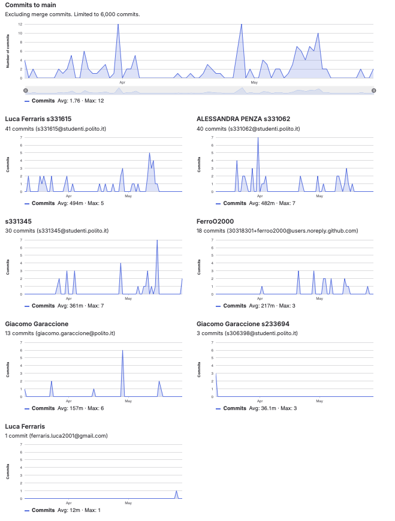

# Gruppo 50

## Valutazione deliverable V1

| gruppo | context diagram | business model | stakeholder | stories | interface | FR | NFR | use cases diagram | use cases | scenario | Glossary | DeploymentDiagram | functionality | estimation doc | precisione valori estimation | valutazione |
| --- | --- | --- | --- | --- | --- | --- | --- | --- | --- | --- | --- | --- | --- | --- | --- | --- |
| - | 1 | 0.5 | 0.5 | 1 | 1 | 3 | 3 | 1 | 5 | 5 | 5 | 2 | 1 | 2 | 2 | 33 |
| 50 | 95 | 100 | 95 | 80 | 95 | 95 | 95 | 95 | 100 | 100 | 95 | 90 | 100 | 95 | 99.97 | 97.82 |

## Valutazione deliverable V2

| gruppo | context diagram | business model | stakeholder | stories | interface | FR | NFR | ACCESS RIGHTS | use cases diagram | use cases | scenario | Glossary | DeploymentDiagram | functionality | estimation | precisione valori estimation | valutazione |
| --- | --- | --- | --- | --- | --- | --- | --- | --- | --- | --- | --- | --- | --- | --- | --- | --- | --- |
| - | 1 | 0.5 | 0.5 | 1 | 1 | 3 | 2 | 1 | 1 | 5 | 5 | 5 | 2 | 1 | 2 | 2 | 33 |
| 50 | 100 | 100 | 100 | 100 | 80 | 100 | 100 | 100 | 100 | 100 | 100 | 100 | 80 | 90 | 95 | 99.26 | 99.06 |

Le percentuali di v2 sono state riscalate in quanto la media pesata delle percentuali portava alcuni gruppi oltre al 100%.

## Valutazione codice e test (V2 + V3)

| Test Unit Totali | Test Unit Passati | Statement Coverage Unit | Branch Coverage Unit | Function Coverage Unit | Line Coverage Unit | Test Integration Totali | Test Integration Falliti | Statement Coverage Integration | Branch Coverage Integration | Function Coverage Integration | Line Coverage Integration | Correttezza V2 | Correttezza V3 | valutazione |
| --- | --- | --- | --- | --- | --- | --- | --- | --- | --- | --- | --- | --- | --- | --- |
| 1 | 0.5 | 2 | 2 | 1 | 1 | 1 | 0.5 | 2 | 2 | 1 | 1 | 16 | 2 | 33 |
| 50 | 100 | 100 | 100 | 100 | 100 | 50 | 75 | 75 | 50 | 75 | 75 | 76.4705882352941 | 100 | 79.12 |

 Unit e integration test prodotti dai gruppi sono stati eseguiti con la versione V2 del codice.

## Risultati Progetto

| Deliverable | Punteggio | Peso |
| --- | --- | --- |
| **Documenti V1** | 97.82% | 6 |
| **Documenti V2** | 97.73% | 2 |
| **Codice e Test** | 79.12% | 22 |
| **Timesheet** | 33.33% | 3 |
| **Valutazione** | 26.23 | 33 |
| **Valutazione** | 10.49 | 13.2 |

## Calcolo pesi progetto per singolo studente

| cognome | nome | email | gruppo | commit studente | commit totali | commit sul totale | coefficiente catme | coefficiente pesato | coefficiente progetto |
| --- | --- | --- | --- | --- | --- | --- | --- | --- | --- |
| FERRARIS | LUCA | s331615@studenti.polito.it | 50 | 42 | 130 | 0.32 | 1.00 | 0.86 | 0.96 |
| FERRO | OMAR | s333155@studenti.polito.it | 50 | 18 | 130 | 0.14 | 1.00 | 0.83 | 0.92 |
| GALTIERI | CHIARA | s331345@studenti.polito.it | 50 | 30 | 130 | 0.23 | 0.94 | 0.80 | 0.89 |
| PENZA | ALESSANDRA | s331062@studenti.polito.it | 50 | 40 | 130 | 0.31 | 1.05 | 0.90 | 1.00 |

 I pesi del progetto sono ottenuti per l'80% dal valore calcolato da CATME e per il 20% dalla percentuale dei commit del singolo studente sul totale dei commit effettuati dagli studenti dello stesso gruppo. Il risultato è stato poi riscalato in modo che il punteggio più alto del gruppo ottenesse 1.

## Studenti

| Nome | Matricola | Email | Bonus | Voto Primo Appello | Voto Secondo Appello | Voto terzo appello | Voto Progetto | Voto Finale |
| --- | --- | --- | --- | --- | --- | --- | --- | --- |
| LUCA FERRARIS | 331615 | s331615@studenti.polito.it | 0 | 15.6 | | |10.06 | 26 |
| ALESSANDRA PENZA | 331062 | s331062@studenti.polito.it | 1 | | 12.6  | |v10.49 | 24 |
| OMAR FERRO | 333155 | s333155@studenti.polito.it | 0 |  | | 19.2 | 9.63  |  29 |
| CHIARA GALTIERI | 331345 | s331345@studenti.polito.it | 1 | | 14.7 | | 9.29 | 25  |
